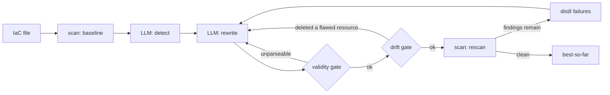

# llm-iac-security

[](https://github.com/Shlok014/llm-iac-security/actions/workflows/ci.yml)
[](pyproject.toml)
[](LICENSE)
[](eval/results/RESULTS.md)

An LLM + static-analysis pipeline that finds misconfigurations in Terraform and Dockerfiles,
rewrites them, and then **checks whether the rewrite actually fixed anything** — including
whether the model "fixed" a problem by quietly deleting the resource it was about.

That last check is the point of the project. Making findings go down is easy. Making
infrastructure safer is not the same thing, and almost nothing measures the difference.

### Try it in 30 seconds — no API key, no cost

```bash
make setup                 # venv on python3.11-3.13 + editable install
make baseline              # scan the whole corpus with Checkov + Trivy
make report                # regenerate every published number from the committed cache
```

`make report` reproduces this repo's results **offline**, from cached model responses. If the
numbers below don't match what you get, that's a bug worth an issue.

---

## The headline result

Asked to secure `samples/vulnerable_main.tf`, the model made a public-bucket-policy finding
disappear by **deleting `aws_s3_bucket_policy.public_policy` outright** — in **5 of 6 runs**,
across both corpus variants and all three seeds. Always the same resource.

That scores a perfect finding delta. It passes the syntax gate. Precision and recall are
untouched. And the next `terraform apply` silently strips the bucket policy off live
infrastructure. Nothing was secured.

This is not a fluke of one sample — it is a reproducible behaviour, and the drift metric is the
only signal in the pipeline that can tell it apart from a real fix.

---

## Measured results

72 model calls — 6 fixtures × 2 corpus variants × 3 seeds. 52 hand-labelled planted flaws,
`gpt-4o-mini-2024-07-18`, `temperature=0`. Figures are `mean [min, max]` over the three repeats.
Every number regenerates offline from the committed response cache:

```bash
.venv/bin/python -m eval.run_eval report   # no API key, no network, no cost
```

**Remediation — what the pipeline is actually good at**

| Scanner | Before | After | Resolved | Introduced |
|---|---:|---:|---:|---:|
| Checkov | 70 | 42.3 [42, 43] | **39.5%** [38.6, 40.0] | **0** |
| Trivy | 57 | 30.3 [18, 37] | **46.8%** [35.1, 68.4] | **0** |

Output validity: **36/36 parsed**. Zero findings introduced in any run — the model never wrote a
new misconfiguration while fixing an old one.

**Detection — where it loses to a free tool**

| | Recall vs 52 planted labels |
|---|---:|
| Checkov alone | **46.2%** |
| Trivy alone | 40.4% |
| Both scanners combined | 53.8% |
| **The LLM** | **39.1%** [36.5, 40.4] |

The LLM finds *fewer* real flaws than Checkov does for free, at 59.3% strict precision. The
original project claimed contextual understanding as the LLM's advantage; measured, it is behind
the free tool at detection. Its value is remediation — scanners cannot rewrite anything at all.

**Label leakage — how much of that was reading the answer key**

The fixtures annotate their own planted flaws in comments (`# <- public-read is insecure`). Run
detection on the commented and comment-stripped corpora and subtract:

| | Recall |
|---|---:|
| Commented (contaminated) | 52.6% [48.1, 57.7] |
| Stripped (headline) | 39.1% [36.5, 40.4] |
| **Leakage** | **13.5 points** |

**About a quarter of the model's apparent detection ability was comprehension of the comments,
not of the code.** Any evaluation on self-annotated fixtures that skips this control is
overstating its result — including, necessarily, the original version of this project.

**Semantic drift — the number that audits the headline**

| Variant | Terraform outputs | Drifted | Touched a flaw-carrying resource |
|---|---:|---:|---:|
| Commented | 12 | 3 (25.0%) | **3** |
| Stripped | 12 | 2 (16.7%) | **2** |

Every one of those five events is the same thing: `aws_s3_bucket_policy.public_policy` deleted
rather than restricted.

⚠️ Descriptive statistics over 3 seeds on **6 synthetic fixtures**. n is far too small for
confidence intervals or significance claims. They show the pipeline works and is measurable;
they do not generalise. See [Limitations](#limitations).

---

## Quickstart

Requires Python 3.11–3.13. **Not 3.14** — checkov's `networkx` dependency crashes there.

```bash
python3.13 -m venv .venv && .venv/bin/pip install -e .
.venv/bin/python -m iac_agent.cli scan samples/vulnerable_main.tf   # no API key needed
cp .env.example .env                                                # add a key for `fix`
.venv/bin/python -m iac_agent.cli fix samples/s3_public.tf
```

`scan` never constructs a model client, needs no key and costs nothing. It is also what the
GitHub Action runs.

---

## How it works



The loop stops on exactly four conditions — `CONVERGED`, `MAX_ITERS`, `NO_PROGRESS`,
`TOKEN_BUDGET` — and **always returns the best candidate it saw, never the last one**. A later
iteration can be worse than an earlier one, so returning the last attempt would silently regress.
If nothing ever beats the original file, you get the original file back.

Two gates stand between the model and a green result:

- **Validity.** Unparseable output is never scanned and never accepted. An empty file scans clean.
- **Drift.** A candidate that deleted or renamed a resource carrying a finding is rejected
  outright — not ranked lower, rejected. "Fixed it by deleting it" is not a worse answer, it is
  not an answer.

---

## Fail closed

The project this replaces claimed its remediations were validated by Checkov. They never were.
The code called `python3 -m checkov`, and checkov ships no `__main__` module, so that command
fails on every Python version. Empty output was then read as *"no issues found"* — so a scanner
that never ran once reported a clean pass on every file.

Everything here is built so that cannot recur. A scanner that could not answer must never be
representable as a scanner that answered "clean":

| Condition | Result |
|---|---|
| Binary missing, timeout, unexpected exit code | `ScannerError` |
| Empty stdout, non-JSON output, unexpected shape | `ScannerError` |
| `"There are no runners to run"` on stderr | `ScannerError` |
| Unparseable remediation | rejected, never scanned |
| CLI: tooling failed vs findings found | **exit 2 vs exit 1** |

That third row is the subtle one. Ask Checkov for a framework that doesn't match the file and it
logs an error, **exits 0**, and prints a well-formed empty report — byte-identical to what a
legitimately resource-less file produces. It cannot be caught from the report's shape, so the
guard keys on stderr. Verified: `samples/vulnerable.Dockerfile` has five genuine findings and was
being reported as a clean scan.

---

## Evaluation

Ground truth lives in [`eval/labels/`](eval/labels/) — planted flaws mapped to the scanner rule
IDs that fire on them. **Every ID was copied from live scanner output, never written from
memory.** The evaluated subset is 52 flaws across 6 fixtures, of which **24 are invisible to both
scanners**; that gap is the honest headroom for an LLM, and the only defensible basis for
claiming one adds value.

`samples/secure/` holds the negative controls — realistic, genuinely secure IaC scoring **zero
findings** from both scanners. Without clean files there is no way to measure false alarms on
correct infrastructure, and "does it cry wolf?" is a fair question to ask a security tool.

The fixtures annotate their own planted flaws in comments (`# <- public-read is insecure`), so
scoring detection on them as-written is contaminated — the model can read the answer key.
Headline detection numbers are therefore measured on a comment-stripped corpus, and the gap
between the two variants is published as the leakage figure above. Both variants produce
identical scanner totals (checkov 70 / trivy 57), which is how we know stripping removed prose
and nothing else.

Method, formulas and threats to validity: [`docs/EVALUATION.md`](docs/EVALUATION.md).

---

## Limitations

- **The published numbers cover 6 synthetic fixtures**, hand-written to be vulnerable. They show
  the pipeline works and is measurable; they say nothing about organically-written IaC.
  The corpus has since grown to 12 vulnerable fixtures plus 3 secure negative controls, but the
  evaluation above has **not** been re-run across it — that is the obvious next step and is not
  quietly implied to have happened. `make report` reproduces exactly what is published, no more.
- **n = 3 seeds.** Descriptive statistics only — `mean [min, max]`. No confidence intervals, no
  significance tests, no claim that one configuration beats another. Trivy's delta in particular
  ranges 35.1%–68.4% across seeds, so treat the mean as indicative rather than as a result.
- **The stripped corpus is less contaminated, not clean.** Resource names like `insecure_sg` and
  string literals still hint at the planted flaw, so 13.5 points is a *lower bound* on leakage.
- **Syntax, not semantics.** `hcl2` proves the output parses; it does not run `terraform
  validate`, resolve references, or check provider schemas. A file can pass and still not apply.
- **Drift is measured at resource-address level**, which is weaker than a real `terraform plan`
  diff. It catches deletions and renames, not a resource silently reconfigured into uselessness.
- **AWS, Terraform and Dockerfiles only.** No Azure, GCP, Kubernetes or CloudFormation.
- **`temperature=0` and a fixed seed reduce non-determinism; they do not remove it.**
- **The adjudicated precision figure is produced by the system's author judging the system's
  output.** The strict figure is published alongside it as the defensible floor.

---

## Origin & attribution

Built as a third-year B.Tech (CSIT — Cybersecurity) Innovative Project at **Symbiosis Skills &
Professional University, Pune**, December 2025, by **Shlok Dahale, Rugved Bidwai, Swaraj Singh
and Atharva Ahire**.

Everything after the initial import commit is post-submission engineering by Shlok Dahale. The
submitted report is frozen; corrections to it are recorded in [`ERRATA.md`](ERRATA.md) rather
than by editing it.

Reference work: D. Toprani and V. K. Madisetti, *LLM Agentic Workflow for Automated Vulnerability
Detection and Remediation in Infrastructure-as-Code*, IEEE Access vol. 13, 2025,
[10.1109/ACCESS.2025.3560911](https://doi.org/10.1109/ACCESS.2025.3560911). That work uses
retrieval-augmented generation and multi-agent orchestration on Amazon Bedrock, and evaluates 10
CloudFormation templates annotated by one engineer. This project does neither RAG nor multi-agent
orchestration — it is a single-model pipeline with a verifier in the loop. What it adds is the
evaluation: committed ground truth, a reproducible offline harness, and failure-mode accounting.

## Documentation

[`docs/`](docs/) — [architecture](docs/ARCHITECTURE.md), [low-level design](docs/LLD.md),
[evaluation method](docs/EVALUATION.md), [threat model](docs/THREAT_MODEL.md),
[decision records](docs/DECISIONS.md), [development guide](docs/DEVELOPMENT.md).

⚠️ `samples/` contains **deliberately vulnerable** IaC used as test fixtures. See
[`SECURITY.md`](SECURITY.md). Do not deploy it.

MIT licensed.
