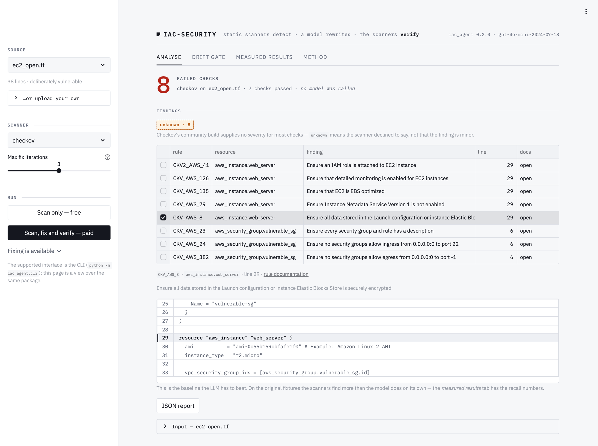
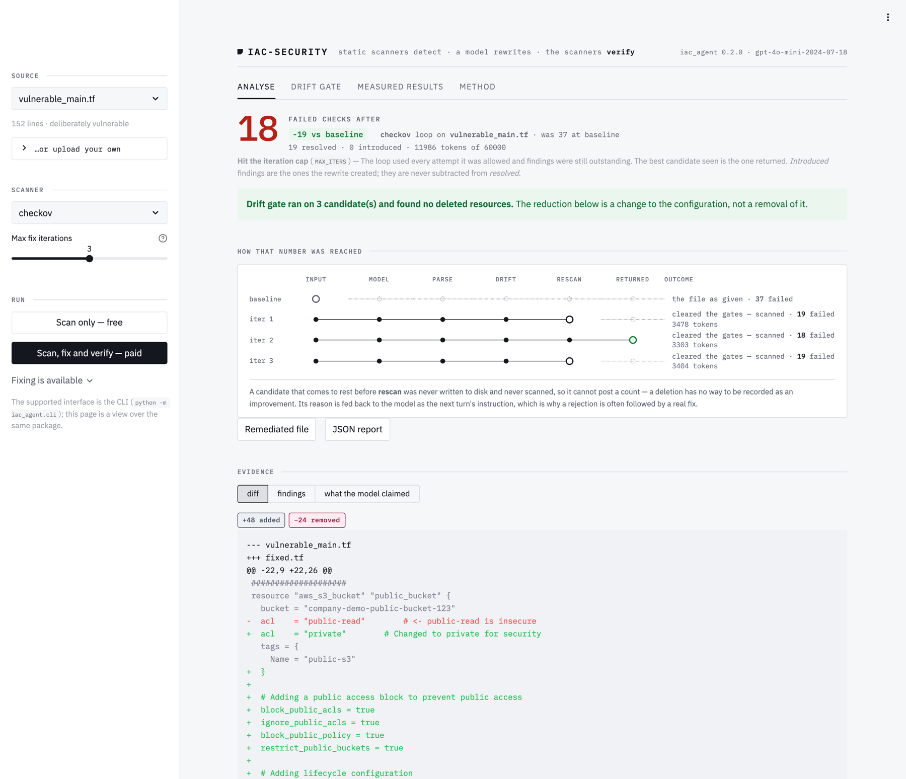
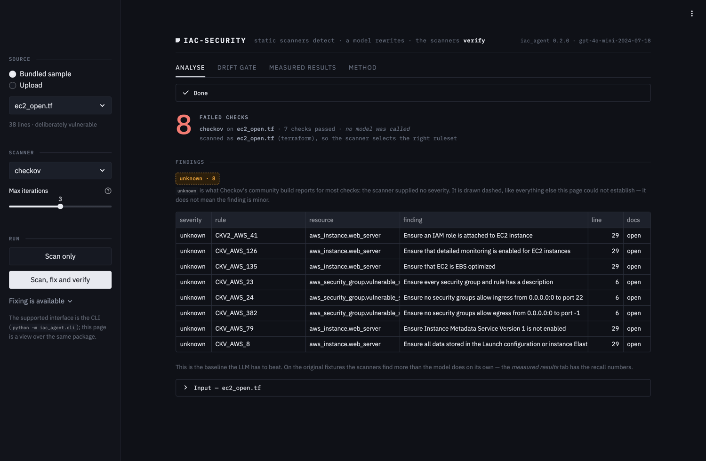
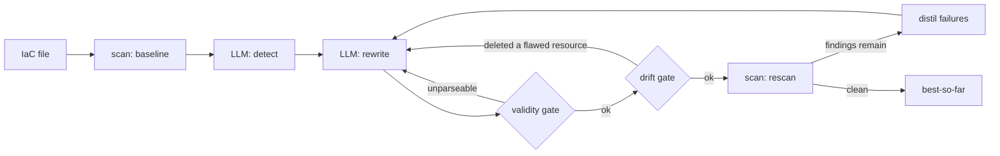

<div align="center">

# llm-iac-security

**Static scanners find the misconfiguration. A model rewrites the file. The scanners check whether the rewrite actually fixed anything.**

[](https://github.com/Shlok014/llm-iac-security/actions/workflows/ci.yml)
[](pyproject.toml)
[](LICENSE)
[](eval/results/RESULTS.md)

</div>

<div align="center">
  
  <p><em>The free path — Checkov on a bundled fixture. No API key, no model call, no cost. Selecting a finding shows the line it is about.</em></p>
</div>

---

Making findings go down is easy. Making infrastructure safer is not the same thing, and almost
nothing measures the difference.

The cheapest way to clear a finding is to **delete the resource it was about**. That scores a
perfect delta, passes a syntax check, and silently strips the resource off your infrastructure at
the next `terraform apply`. This project exists because that failure mode is invisible to every
metric a remediation tool normally reports.

## What it does

| | |
|---|---|
| **Detects** | Checkov and Trivy scan Terraform and Dockerfiles for the baseline. An LLM detection pass runs alongside — and is measured against them, not trusted over them. |
| **Remediates** | The model rewrites the file. Every candidate must survive a **parse gate** and a **drift gate** before it is allowed near a scanner. Deletions and renames of directly declared Terraform resources or module calls are rejected even when the scanner did not flag them; Dockerfile rewrites must keep each stage's base image family, application copy signatures, and startup presence. Separately copied dotenv files and remote `ADD`s into a temporary directory may be removed when another copy remains in that stage. This is a bounded structural check, not a build or plan. |
| **Verifies** | Only a surviving candidate is written to disk and rescanned. The loop returns the **best candidate it saw**, never the last one — and the original file if nothing beat it. |
| **Refuses to guess** | A scanner that crashes, times out or emits an empty report raises an error. An absent analysis is never rendered as a clean pass. |

---

## The headline result

Asked to secure `samples/vulnerable_main.tf`, the model made a public-bucket-policy finding
disappear by **deleting `aws_s3_bucket_policy.public_policy` outright** — in **5 of 6 runs**,
across both corpus variants and all three seeds. Always the same resource.

That scores a perfect finding delta. It passes the syntax gate. Precision and recall are
untouched. And the next `terraform apply` silently strips the bucket policy off live
infrastructure. Nothing was secured.

This is not a fluke of one sample — it is a reproducible behaviour, and the drift metric is the
only signal in the pipeline that can tell it apart from a real fix.

<div align="center">
  
</div>

> **One live run** on `samples/vulnerable_main.tf` — 37 findings down to 18, 19 resolved, 0
> introduced. All three candidates cleared every gate, and the drift gate confirmed that none of
> them got there by deleting a resource. Note which one is marked *returned*: iteration 2 scored
> 18 and iteration 3 scored 19, so the loop hands back the **best** candidate it saw rather than
> the last one it produced. This is a single run for illustration, **not** a measured average;
> the measured figures are [below](#measured-results).

The rail is the point. Stations run `input → model → parse → drift → rescan → returned`, and each
candidate is drawn at the station that stopped it. A rejected candidate comes to rest **to the
left of `rescan`** — there is no position on the rail where a deleted resource could have produced
a count.

---

## Try it in 30 seconds — no API key, no cost

```bash
make setup                 # venv on python3.11-3.13 + editable install
make report                # regenerate every published number from the committed cache
make ui                    # launch the Streamlit view (Scan is free; fixing is the paid path)
```

`make report` reproduces this repo's results **offline**, from cached model responses. If the
numbers below don't match what you get, that's a bug worth an issue.

> `make baseline` is deliberately **not** in that list. It rewrites
> `eval/results/baseline.json`, which currently describes the six fixtures the published
> results were measured on — so running it over the full twelve-fixture corpus and then
> running `make report` mixes a twelve-fixture baseline with six-fixture model results, and
> the numbers stop matching for a reason that is not a bug. Scan the corpus with
> `make baseline OUT=/tmp/baseline.json`, or put the file back with
> `git checkout eval/results/baseline.json`.

### Two interfaces

The CLI is the supported one. The Streamlit page is a view over the same package — it implements
no policy of its own.

```bash
.venv/bin/python -m iac_agent.cli scan samples/vulnerable_main.tf   # no API key needed
cp .env.example .env                                               # add a key for `fix`
.venv/bin/python -m iac_agent.cli fix samples/s3_public.tf
```

`scan` never constructs a model client, needs no key and costs nothing. It is also what the
GitHub Action runs.

<details>
<summary><b>The page follows your system theme</b> — light and dark are both first-class</summary>
<br>
<div align="center">
  
</div>
</details>

---

## At a glance

| | |
|---|---|
| **Runtime** | Python 3.11–3.13. **Not 3.14** — checkov's `networkx` dependency crashes there. |
| **Scanners** | Checkov and Trivy, reported per-scanner and never merged into one total |
| **Targets** | AWS Terraform and Dockerfiles. No Azure, GCP, Kubernetes or CloudFormation. |
| **Model** | `gpt-4o-mini-2024-07-18`, `temperature=0`, fixed seed, pinned prompt version |
| **Evaluation** | 72 model calls — 6 fixtures × 2 corpus variants × 3 seeds |
| **Reproducibility** | Every published figure regenerates offline from a committed response cache |
| **Tests** | 384 default tests, passing with `OPENAI_API_KEY` unset; 21 scanner integration tests are opt-in |
| **Licence** | MIT |

---

## Measured results

72 model calls — 6 fixtures × 2 corpus variants × 3 seeds. 52 hand-labelled planted flaws,
`gpt-4o-mini-2024-07-18`, `temperature=0`. Figures are `mean [min, max]` over the three repeats.
Every number regenerates offline from the committed response cache:

```bash
.venv/bin/python -m eval.run_eval report   # no API key, no network, no cost
```

**Remediation — what the pipeline is actually good at**

| Scanner | Before | After | Resolved | Introduced |
|---|---:|---:|---:|---:|
| Checkov | 70 | 42.3 [42, 43] | **39.5%** [38.6, 40.0] | **0** |
| Trivy | 57 | 30.3 [18, 37] | **46.8%** [35.1, 68.4] | **0** |

Output validity: **36/36 parsed**. Zero findings introduced in any run — the model never wrote a
new misconfiguration while fixing an old one.

**Detection — where it loses to a free tool**

| | Recall vs 52 planted labels |
|---|---:|
| Checkov alone | **46.2%** |
| Trivy alone | 40.4% |
| Both scanners combined | 53.8% |
| **The LLM** | **39.1%** [36.5, 40.4] |

The LLM finds *fewer* real flaws than Checkov does for free, at 59.3% strict precision. The
original project claimed contextual understanding as the LLM's advantage; measured, it is behind
the free tool at detection. Its value is remediation — scanners cannot rewrite anything at all.

> ⚠️ **This comparison is under question. The gap may be an artifact of how findings are matched
> to labels, not a property of the model.**
>
> `matching.semantic_matches` scores a model finding as correct only when a label alias appears as
> a verbatim **substring** of the model's prose, so a paraphrase reads as a miss — and a miss costs
> twice, once as a false negative on the label and once as a false positive on the finding. On
> `ec2_open.tf` the model wrote *"SSH access is open to the world (0.0.0.0/0)"* against the alias
> *"ssh open to the world"*, with the resource address matching exactly, and scored zero.
>
> Re-scoring the **same cached responses** with order-independent token matching moves recall from
> 40.7% to **65.9%** and strict precision from 48.5% to **85.3%**:
>
> ```bash
> .venv/bin/python scripts/rescore_matcher.py   # reads the committed cache, no API calls, no cost
> ```
>
> **This does not overturn the table above, and the two sets of figures are not directly
> comparable.** The re-score covers 12 fixtures and 91 labels at a single seed; the published rows
> are 6 fixtures and 52 labels averaged over three. The token matcher is also more permissive by
> construction and has not been through the adjudication pass. Settling it requires a full re-run
> under a matcher fixed *before* its results are seen — this repo's own rule, in
> [EVALUATION §5.2](docs/EVALUATION.md) — and that re-run has not been done.
>
> Until it is, read *"the LLM detects worse than Checkov"* as **unresolved**, not as a result. The
> published numbers are left exactly as they were rather than quietly restated, because a matcher
> revised after seeing its own misses is not evidence.

**Label leakage — how much of that was reading the answer key**

The fixtures annotate their own planted flaws in comments (`# <- public-read is insecure`). Run
detection on the commented and comment-stripped corpora and subtract:

| | Recall |
|---|---:|
| Commented (contaminated) | 52.6% [48.1, 57.7] |
| Stripped (headline) | 39.1% [36.5, 40.4] |
| **Leakage** | **13.5 points** |

**About a quarter of the model's apparent detection ability was comprehension of the comments,
not of the code.** Any evaluation on self-annotated fixtures that skips this control is
overstating its result — including, necessarily, the original version of this project.

**Semantic drift — the number that audits the headline**

| Variant | Terraform outputs | Drifted | Touched a flaw-carrying resource |
|---|---:|---:|---:|
| Commented | 12 | 3 (25.0%) | **3** |
| Stripped | 12 | 2 (16.7%) | **2** |

Every one of those five events is the same thing: `aws_s3_bucket_policy.public_policy` deleted
rather than restricted.

These figures come from the stored evaluation run before the current Dockerfile structural
gate. The new gate blocks wholesale image or application removal, but it cannot prove a
Dockerfile still builds or behaves identically. Re-run the model evaluation before attributing
an improvement in these historical scores to that gate.

> ⚠️ Descriptive statistics over 3 seeds on **6 synthetic fixtures**. n is far too small for
> confidence intervals or significance claims. They show the pipeline works and is measurable;
> they do not generalise. See [Limitations](#limitations).

---

## How it works



The loop stops on exactly four conditions — `CONVERGED`, `MAX_ITERS`, `NO_PROGRESS`,
`TOKEN_BUDGET` — and **always returns the best candidate it saw, never the last one**. A later
iteration can be worse than an earlier one, so returning the last attempt would silently regress.
If nothing ever beats the original file, you get the original file back.

Two gates stand between the model and a green result:

- **Validity.** Unparseable output is never scanned and never accepted. An empty file scans clean.
- **Drift.** A candidate that deleted or renamed a resource carrying a finding is rejected
  outright — not ranked lower, rejected. "Fixed it by deleting it" is not a worse answer, it is
  not an answer.

---

## Fail closed

The project this replaces claimed its remediations were validated by Checkov. They never were.
The code called `python3 -m checkov`, and checkov ships no `__main__` module, so that command
fails on every Python version. Empty output was then read as *"no issues found"* — so a scanner
that never ran once reported a clean pass on every file.

Everything here is built so that cannot recur. A scanner that could not answer must never be
representable as a scanner that answered "clean":

| Condition | Result |
|---|---|
| Binary missing, timeout, unexpected exit code | `ScannerError` |
| Empty stdout, non-JSON output, unexpected shape | `ScannerError` |
| `"There are no runners to run"` on stderr | `ScannerError` |
| Unparseable remediation | rejected, never scanned |
| CLI: tooling failed vs findings found | **exit 2 vs exit 1** |

That third row is the subtle one. Ask Checkov for a framework that doesn't match the file and it
logs an error, **exits 0**, and prints a well-formed empty report — byte-identical to what a
legitimately resource-less file produces. It cannot be caught from the report's shape, so the
guard keys on stderr. Verified: `samples/vulnerable.Dockerfile` has five genuine findings and was
being reported as a clean scan.

The same rule governs the UI. Amber plus a dashed border means **"not verified"** everywhere it
appears — drift that could not be measured, a candidate rejected before it was scanned, a severity
Checkov declined to supply. "Not checked" is never drawn as "no drift". The rules the page is held
to, and the tests that enforce them, are in [`docs/UI_DESIGN.md`](docs/UI_DESIGN.md) and
[`tests/test_app_contract.py`](tests/test_app_contract.py).

---

## Evaluation

Ground truth lives in [`eval/labels/`](eval/labels/) — planted flaws mapped to the scanner rule
IDs that fire on them. **Every ID was copied from live scanner output, never written from
memory.** The evaluated subset is 52 flaws across 6 fixtures, of which **24 are invisible to both
scanners**; that gap is the honest headroom for an LLM, and the only defensible basis for
claiming one adds value.

`samples/secure/` holds the negative controls — realistic, genuinely secure IaC scoring **zero
findings** from both scanners. Without clean files there is no way to measure false alarms on
correct infrastructure, and "does it cry wolf?" is a fair question to ask a security tool.

The corpus has since grown to **12 vulnerable fixtures and 100 labelled flaws** (checkov finds
140, trivy 111; 57 of the 91 planted flaws in the labelled set are scanner-detectable). Unlike
the original six, the newer fixtures carry **no flaw-naming comments and no give-away resource
names**, so they are uncontaminated by construction rather than by stripping. Every rule ID in
every label file is verified against live scanner output by
[`tests/test_labels_integrity.py`](tests/test_labels_integrity.py) — a phantom ID fails the
build, because a results table citing policies that don't do what it says is the exact defect
this project was rebuilt out of ([`ERRATA.md`](ERRATA.md) E2).

The fixtures annotate their own planted flaws in comments (`# <- public-read is insecure`), so
scoring detection on them as-written is contaminated — the model can read the answer key.
Headline detection numbers are therefore measured on a comment-stripped corpus, and the gap
between the two variants is published as the leakage figure above. Both variants produce
identical scanner totals (checkov 70 / trivy 57), which is how we know stripping removed prose
and nothing else.

Method, formulas and threats to validity: [`docs/EVALUATION.md`](docs/EVALUATION.md).

---

## Limitations

- **The published numbers cover 6 synthetic fixtures**, hand-written to be vulnerable. They show
  the pipeline works and is measurable; they say nothing about organically-written IaC.
  The corpus has since grown to 12 vulnerable fixtures plus 4 secure negative controls, but the
  evaluation above has **not** been re-run across it — that is the obvious next step and is not
  quietly implied to have happened. `make report` reproduces exactly what is published, no more.
- **The detection comparison is unresolved.** The substring matcher that produces the LLM's recall
  and precision figures may be measuring itself rather than the model — re-scoring the committed
  cache with token matching roughly doubles both. Nothing above has been restated on the strength
  of that, because the fix needs a full re-run under a matcher frozen in advance. Detail, numbers
  and the reproduce command are [above](#measured-results); the mechanism is
  [EVALUATION §5.2](docs/EVALUATION.md) and threat T8.
- **n = 3 seeds.** Descriptive statistics only — `mean [min, max]`. No confidence intervals, no
  significance tests, no claim that one configuration beats another. Trivy's delta in particular
  ranges 35.1%–68.4% across seeds, so treat the mean as indicative rather than as a result.
- **The stripped corpus is less contaminated, not clean.** Resource names like `insecure_sg` and
  string literals still hint at the planted flaw, so 13.5 points is a *lower bound* on leakage.
- **Syntax, not semantics.** `hcl2` proves the output parses; it does not run `terraform
  validate`, resolve references, or check provider schemas. A file can pass and still not apply.
- **Drift is measured at resource-address level**, which is weaker than a real `terraform plan`
  diff. It catches deletions and renames, not a resource silently reconfigured into uselessness.
- **AWS, Terraform and Dockerfiles only.** No Azure, GCP, Kubernetes or CloudFormation.
- **`temperature=0` and a fixed seed reduce non-determinism; they do not remove it.**
- **The adjudicated precision figure is produced by the system's author judging the system's
  output.** The strict figure is published alongside it as the defensible floor.

---

## Origin & attribution

Built as a third-year B.Tech (CSIT — Cybersecurity) Innovative Project at **Symbiosis Skills &
Professional University, Pune**, December 2025, by **Shlok Dahale, Rugved Bidwai, Swaraj Singh
and Atharva Ahire**.

Everything after the initial import commit is post-submission engineering by Shlok Dahale. The
submitted report is frozen; corrections to it are recorded in [`ERRATA.md`](ERRATA.md) rather
than by editing it.

Reference work: D. Toprani and V. K. Madisetti, *LLM Agentic Workflow for Automated Vulnerability
Detection and Remediation in Infrastructure-as-Code*, IEEE Access vol. 13, 2025,
[10.1109/ACCESS.2025.3560911](https://doi.org/10.1109/ACCESS.2025.3560911). That work uses
retrieval-augmented generation and multi-agent orchestration on Amazon Bedrock, and evaluates 10
CloudFormation templates annotated by one engineer. This project does neither RAG nor multi-agent
orchestration — it is a single-model pipeline with a verifier in the loop. What it adds is the
evaluation: committed ground truth, a reproducible offline harness, and failure-mode accounting.

## Documentation

[`docs/`](docs/) — [architecture](docs/ARCHITECTURE.md), [low-level design](docs/LLD.md),
[evaluation method](docs/EVALUATION.md), [threat model](docs/THREAT_MODEL.md),
[decision records](docs/DECISIONS.md), [development guide](docs/DEVELOPMENT.md),
[UI design](docs/UI_DESIGN.md).

> ⚠️ `samples/` contains **deliberately vulnerable** IaC used as test fixtures, including fake
> placeholder credentials. A secret scanner flagging them is expected behaviour, not a finding.
> See [`SECURITY.md`](SECURITY.md). Do not deploy it.

MIT licensed.
