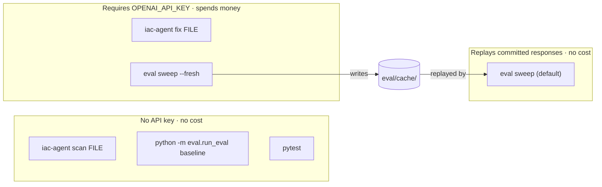

# Development guide

Everything you need to go from a clean clone to a passing test run, plus the traps that cost
this project real time. If you are here to *evaluate* the repo rather than change it, skip to
[Running things](#running-things) — the scanner path and the baseline evaluation need no API key
and cost nothing.

For what the project *is* and why, see the [root README](../README.md). For what the docs
directory contains, see [docs/README.md](README.md).

> Throughout, statements that are traceable to code or to a measurement are stated plainly.
> Anything that describes intended behaviour not yet measured is marked
> *(design intent — not yet measured)*.

---

## Prerequisites

| What | Version | Why this one |
|---|---|---|
| Python | **3.11, 3.12 or 3.13** | 3.14 breaks Checkov. See below. |
| Checkov | 3.2.489 (pinned via the package metadata) | Policy scanner. Installed with pip, into the venv. |
| Trivy | 0.68.x | Second scanner. A Go binary — **not** a pip package. |
| OpenAI API key | — | Needed **only** for the LLM paths (`iac-agent fix`, non-baseline eval). Nothing else in the repo touches it. |

### Do not use Python 3.14

Checkov 3.2.489 crashes on import under Python 3.14. The failure surfaces inside its
`networkx` dependency (dataclass `__slots__` handling) and looks like this:

```
AttributeError: 'wrapper_descriptor' object has no attribute '__annotate__'
```

That string is here so it is searchable. If you see it, you are on the wrong interpreter — this
is not a bug in this repository and there is no workaround short of changing interpreter. The
upper bound is recorded in the packaging metadata rather than left to documentation; see
[ADR-003](DECISIONS.md#adr-003-pin-python-to-311314).

This matters more than it sounds, because on many macOS setups `python3` *is* 3.14:

```console
$ python3 --version
Python 3.14.1                # ← the trap
$ /opt/homebrew/bin/python3.13 --version
Python 3.13.14               # ← what the venv must be built from
```

Always create the virtual environment from an explicit versioned interpreter path, never from a
bare `python3`.

### Installing Trivy

Any installation that puts `trivy` on `PATH` works — the code shells out to the binary and never
imports it. On macOS:

```bash
brew install trivy
trivy --version
```

Checkov is different: it is a Python package, and `scanners.py` deliberately prefers the
`checkov` executable sitting next to the *active interpreter* before falling back to `PATH`
(see `_resolve()` in [`iac_agent/scanners.py`](../iac_agent/scanners.py)). A system-wide Checkov
on a different Python version is exactly the situation that produces confusing failures, so the
venv's own copy wins.

---

## Setup from a clean clone

```bash
git clone https://github.com/Shlok014/llm-iac-security.git
cd llm-iac-security

# 1. Virtual environment — explicit interpreter, no bare `python3`.
/opt/homebrew/bin/python3.13 -m venv .venv        # or /usr/bin/python3.12, etc.
.venv/bin/python --version                        # must print 3.11.x, 3.12.x or 3.13.x

# 2. Editable install, with the development extras (pytest and friends).
.venv/bin/pip install -U pip
.venv/bin/pip install -e ".[dev]"    # [dev] pulls in [ui], so this also installs
                                     # streamlit and pandas — tests/test_app_contract.py
                                     # imports app.py and needs them.

# 3. Environment file. Required only for the LLM paths.
cp .env.example .env
$EDITOR .env                                      # set OPENAI_API_KEY
```

`.env` is gitignored and must stay that way. It is the only file in the repo that ever holds a
secret; nothing in `docs/` or `eval/` should ever print its contents.

> This guide always writes `.venv/bin/python` and `.venv/bin/pytest` explicitly rather than
> telling you to `source .venv/bin/activate`. Both work. The explicit form is used because the
> single most common way to get a mystifying Checkov error is to run the right command against
> the wrong interpreter, and an explicit path cannot drift.

### Verify the install in ten seconds, with no API key

```console
$ .venv/bin/iac-agent scan samples/s3_public.tf
```

The expected result is **8 failed Checkov checks**. If you get 8, the toolchain is correct. If
you get an error, work through [Troubleshooting](#troubleshooting) before touching any code.

The measured baseline across the **six fixtures the published results were computed on** — the
numbers everything else is compared against — is:

| Fixture | Checkov failed | Trivy findings |
|---|---:|---:|
| `samples/vulnerable_main.tf` | 37 | 23 |
| `samples/s3_public.tf` | 8 | 10 |
| `samples/ec2_open.tf` | 8 | 6 |
| `samples/vulnerable_network.tf` | 7 | 5 |
| `samples/docker_insecure.Dockerfile` | 5 | 7 |
| `samples/vulnerable.Dockerfile` | 5 | 6 |
| **Total** | **70** | **57** |

These are measurements, not targets. If your numbers differ, your scanner versions differ —
say so in any result you report rather than quietly comparing against this table.

The corpus has since grown to **12 vulnerable fixtures** (checkov 140, trivy 111) plus four
secure negative controls; see [`samples/README.md`](../samples/README.md) for the per-fixture
breakdown. `eval/results/baseline.json` still describes the original six on purpose, because
the published model results were measured on those and a results table must not mix two
corpora. `make baseline` warns about this before it rewrites the file.

---

## Running things

Two of the four entry points are free. That is deliberate: someone assessing this repository
should be able to reproduce the scanner-side claims without an account, a key, or a cent.



### `iac-agent scan` — static analysis only

```bash
.venv/bin/iac-agent scan samples/vulnerable_main.tf
.venv/bin/iac-agent scan samples/vulnerable.Dockerfile
```

No model is called. Exit codes are the contract:

| Exit | Meaning |
|---:|---|
| `0` | Scanner ran and found nothing. |
| `1` | Scanner ran and found at least one failing check. |
| `2` | Scanner **did not produce a trustworthy result** (`ScannerError`). |

`2` exists as a distinct code for one reason: a scanner that failed to run must never be
confusable with a scanner that found nothing. That confusion is the exact defect this project
was rebuilt to remove — see [Troubleshooting](#troubleshooting) and `ERRATA.md`. In CI,
treat `2` as a hard failure, never as a pass.

Run `--help` for the current flag set (scanner selection, output format). This document
deliberately does not restate the flags; `--help` cannot go stale.

### `iac-agent fix` — the full refinement loop

```bash
.venv/bin/iac-agent fix samples/s3_public.tf
```

**This spends money.** It runs the bounded loop: baseline scan → detect → generate fix →
validity gate → rescan → distilled feedback → refix, stopping on one of four reasons
(`CONVERGED`, `MAX_ITERS`, `NO_PROGRESS`, `TOKEN_BUDGET`) and returning the best result seen,
not the last one attempted. Read [`iac_agent/loop.py`](../iac_agent/loop.py) and
[ADR-013](DECISIONS.md#adr-013-the-loop-returns-best-so-far-not-last-attempt) before changing
anything about iteration accounting — "best-so-far" is the property most easily lost in a
well-meaning refactor.

### The Streamlit app

```bash
.venv/bin/streamlit run app.py
```

`app.py` **is** the current UI. It was the original submitted one for a while, importing
`validate_with_checkov` and friends from a `main.py` whose Checkov invocation never executed;
that module was retired in `7e79ac9` and the page now calls `run_loop` and the scanner registry
directly. Presentation lives in `ui_theme.py` and `.streamlit/config.toml`; the design brief and
the rules the page is held to are in [`UI_DESIGN.md`](UI_DESIGN.md).

The supported interface is still the CLI. Do not add features to `app.py` that do not exist in
`iac_agent/`; the UI is a view, not a second implementation. `tests/test_app_contract.py`
enforces the parts of that which are mechanically checkable — no measured number typed into the
page, no absent analysis rendered as a passing one.

### The evaluation harness

```bash
# Run it as a module, not as a script: `eval/` is a package and `run_eval.py` uses relative
# imports, so `python eval/run_eval.py` dies with "attempted relative import with no known
# parent package" before it parses a single argument.
.venv/bin/python -m eval.run_eval --help

# Free. Scanners only, no model, no key. NOTE: with no --out this rewrites
# eval/results/baseline.json, which describes the six fixtures the published numbers were
# measured on — see the warning `make baseline` prints.
.venv/bin/python -m eval.run_eval baseline --out /tmp/baseline.json

# The LLM sweep. Replays eval/cache/ by default (free); --fresh ignores the cache and
# calls the model for real (paid).
.venv/bin/python -m eval.run_eval run --help
```

Ground truth lives in `eval/labels/*.labels.yaml`, hand-written per fixture. One thing to know
before you trust any detection score: **the fixtures annotate their own planted flaws inline**
(`# <- public-read is insecure`). Scoring detection against the files as-written measures
reading comprehension, not security reasoning. `eval/strip_comments.py` exists to remove those
annotations before the detection prompt is built.

That applies to the **original six** fixtures. The six added later carry no flaw-naming
comments and no give-away resource names, so they need no stripping — they are uncontaminated
by construction. **If you add a fixture, follow that convention**: stripping can remove a
comment, but it cannot remove a hint encoded in a resource name like `insecure_sg`.

`eval/results/RESULTS.md` is **generated**. Never hand-edit it. If a number in it is wrong,
the harness is wrong.

---

## Testing

```bash
.venv/bin/pytest                    # default: the fast, hermetic suite
.venv/bin/pytest -m slow            # only the checks that shell out to real binaries
.venv/bin/pytest -m ""              # everything
```

There is exactly one marker, `slow`, and `pytest.ini` deselects it by default via
`addopts = -m "not slow"`. So the bare `pytest` you run a hundred times a day is the *fast*
suite, and getting the full suite takes the deliberate `-m ""`. Note the consequence: CI runs `-m "not slow"`, so the
end-to-end scanner checks do **not** run there. What covers that gap is the exit-code contract
step in `.github/workflows/ci.yml`, which invokes the real Checkov binary directly and asserts
1 / 0 / 2 for findings / clean / could-not-look.

The split is about subprocesses, not about the network. `slow` means "invokes the real Checkov
or Trivy binary", which costs seconds per file. Nothing in the suite calls a model, at either
speed.

`pytest.ini` also sets `--strict-markers --strict-config`, so a typo'd marker is an error rather
than a silently-empty selection. Configuration lives in `pytest.ini` rather than
`pyproject.toml` on purpose — the `pyproject` spelling is `[tool.pytest.ini_options]`, and a
`[pytest]` section placed in `pyproject.toml` is ignored without warning.

### The rule: the suite must pass with `OPENAI_API_KEY` unset

```bash
env -u OPENAI_API_KEY .venv/bin/pytest -m ""
```

This is not a nicety. A test suite that needs a key is a test suite nobody else can run, that
costs money to run, and that produces different results on Tuesday than it did on Monday. If you
find yourself wanting a real model call in a test, you want a scripted fake instead.

**Measured, not intended.** `.github/workflows/ci.yml` sets `OPENAI_API_KEY: ""` explicitly on
the pytest step, and the suite passes there — so the rule is enforced mechanically rather than
by convention. It was tagged *design intent — not yet measured* here for a long time, which was
fair while CI had never once been allowed to run; it has now.

### Writing a test against a scripted fake model

`LLMClient` takes an **injectable `complete_fn`**. That one constructor parameter is why the LLM
layer is testable at all: the client owns prompt construction, kwarg negotiation and response
parsing, while the thing that actually talks to OpenAI is a function you can replace. The
alternative — patching the OpenAI SDK — was considered and rejected;
[ADR-008](DECISIONS.md#adr-008-injectable-complete_fn-instead-of-mocking-the-openai-sdk) says why.

The contract, from [`iac_agent/llm.py`](../iac_agent/llm.py):

```python
class CompleteFn(Protocol):
    def __call__(self, messages: list[dict[str, str]], **kwargs: Any) -> str | LLMResponse: ...
```

Two details make this pleasant to fake:

- **The optional kwargs are negotiated, not assumed.** `LLMClient` introspects your function's
  signature once at construction (`_accepted_kwargs`) and passes `cfg` / `response_format` only
  if you accept them. So `lambda messages: '[]'` is a complete, valid fake.
- **Returning a bare `str` is fine.** `LLMResponse` exists only so a fake can *also* report token
  usage. A plain string records zero usage rather than an estimated figure, because a made-up
  token count fed into a token budget is worse than an obviously absent one.

A reusable fake:

```python
# tests/conftest.py (or inline in a test module)
from __future__ import annotations

from typing import Any


class ScriptedModel:
    """A fake `complete_fn`: hands back queued responses in order, records what it was asked.

    Deliberately does not accept `cfg` or `response_format` — the client will then send
    neither, which keeps the fake readable. Add them as keyword parameters when a test
    needs to assert on them.
    """

    def __init__(self, *responses: str) -> None:
        self._queue = list(responses)
        self.calls: list[list[dict[str, str]]] = []

    def __call__(self, messages: list[dict[str, str]], **kwargs: Any) -> str:
        self.calls.append(messages)
        if not self._queue:
            # Loudly, rather than returning "" and letting the caller invent a result.
            raise AssertionError("model called more times than the test scripted")
        return self._queue.pop(0)
```

The exhausted-queue assertion is the important line. A refinement loop that fails to terminate
is the most expensive bug this codebase can have, and this turns "ran one extra iteration" into
a red test rather than an extra line on an invoice.

A test using it:

```python
import json

from iac_agent.llm import LLMClient, ModelConfig
from iac_agent.types import IaCType


def test_detect_parses_a_fenced_json_response() -> None:
    fenced = "```json\n" + json.dumps(
        [
            {
                "issue": "Bucket ACL is public-read",
                "severity": "high",
                "resource": "aws_s3_bucket.demo",
                "recommendation": 'Set acl = "private".',
            }
        ]
    ) + "\n```"

    model = ScriptedModel(fenced)
    client = LLMClient(ModelConfig(), complete_fn=model)

    findings = client.detect_vulnerabilities(
        'resource "aws_s3_bucket" "demo" {}', IaCType.TERRAFORM
    )

    assert [f["severity"] for f in findings] == ["high"]
    assert len(model.calls) == 1, "detection must be a single call"
    assert model.calls[0][0]["role"] == "system"
```

Note what is being asserted: not "the model is smart", but "our code survives the shapes models
actually emit". Fenced JSON, trailing commas, a `{"findings": [...]}` envelope instead of a bare
array — those are the real failure modes, they are all handled in
[`iac_agent/parsing.py`](../iac_agent/parsing.py), and a scripted fake is the only sane way to
reach them.

The same seam is what makes the refinement loop testable: script three responses, assert the
loop stopped for the reason you expected, and assert the returned artifact is the best one seen
rather than the last one produced. That assertion is worth writing explicitly — "returns
best-so-far" is a property that decays silently the moment someone refactors the iteration
bookkeeping.

`LLMClient.is_injected` tells you whether a client is faked. `reset_usage()` and `usage` /
`last_usage` expose the token counters the loop's budget stop condition reads.

---

## Cost discipline

| Operation | Cost |
|---|---|
| `iac-agent scan` | **Free.** No model call, no key read. |
| `pytest`, at any marker selection | **Free.** No model call. |
| `python -m eval.run_eval baseline` | **Free.** Scanners only. |
| Eval sweep, cached (default) | **Free.** Replays `eval/cache/`. |
| Eval sweep, `--fresh` | **Paid.** Every fixture, every iteration, live. |
| `iac-agent fix` | **Paid.** One loop over one file. |

How the spend scales: one detection call per file, then one fix call per refinement iteration.
A single file capped at *N* iterations therefore costs at most `1 + N` model calls, and a sweep
over the six fixtures at most `6 × (1 + N)`.

Note what is *not* in that count. `distill_failures()` compresses a `ScanResult` into a handful
of `{rule, resource}` dicts with **no model call at all** — it is ordinary Python. That is a
cost decision as much as a quality one: one Checkov failed check carries a guideline URL, the
offending code block, connected-node graphs and file ranges, and `vulnerable_main.tf` fails 37
of them. Feeding that raw JSON back into the next prompt is the difference between a cheap run
and an expensive one, and it buries the only signal the model needs — which rule, on which
resource. The `TOKEN_BUDGET` stop reason then enforces the ceiling in code rather than relying
on your attention.

*(Not yet measured: actual tokens and dollars per full sweep. The harness records usage; fill
this in from `eval/results/RESULTS.md` once a fresh sweep has been run. Do not estimate it here
— an invented number in a cost table is how people get surprised.)*

Three habits that keep the bill near zero:

1. **Use the cache.** `eval/cache/` is committed precisely so metrics regenerate offline. A
   reviewer cloning the repo should be able to reproduce every reported number without a key —
   that is the whole argument of
   [ADR-009](DECISIONS.md#adr-009-commit-the-eval-response-cache).
2. **`--fresh` is a deliberate act.** It is the only way to spend money in the eval path, which
   is why it is an explicit flag rather than a cache-miss fallback.
3. **The model is pinned, and the pin is the cache key.** `ModelConfig` pins the snapshot
   `gpt-4o-mini-2024-07-18` with `temperature=0` and `seed=42`, and `ModelConfig.fingerprint()`
   folds the model, temperature, seed, token cap **and `prompt_version`** into one string.
   Including the prompt version is the point: two runs of the same model at the same temperature
   are not comparable if the prompt changed between them. So editing a prompt invalidates the
   cache by design — and that invalidation is exactly the moment a fresh, paid sweep is
   justified.

---

## Troubleshooting

| Symptom | Cause | Fix |
|---|---|---|
| `AttributeError: 'wrapper_descriptor' object has no attribute '__annotate__'` | Checkov 3.2.489 on Python 3.14 (networkx dataclass slots). | Rebuild the venv from 3.11–3.13. Not fixable in this repo. |
| `No module named checkov.__main__; 'checkov' is a package and cannot be directly executed` | You ran `python -m checkov`. Checkov ships **no** `__main__` module, on any Python version. | Use the console script: `.venv/bin/checkov`. See the note below — this is the original bug. |
| First `trivy config` run hangs or fails offline | Trivy downloads its Rego checks bundle (`mirror.gcr.io/aquasec/trivy-checks:1`) into `~/Library/Caches/trivy` on first use. | Run it once with network access. Afterwards `--skip-check-update` keeps it offline and fast. |
| `ModuleNotFoundError: No module named 'pandas'` when starting the Streamlit app | `app.py` imports pandas, which was historically absent from `requirements.txt`. | Install via the packaging metadata (`pip install -e ".[dev]"`), which is the source of truth. `requirements.txt` was deleted in `7e79ac9`; the extras in `pyproject.toml` are the only source of truth, and `[dev]` now pulls in `[ui]` so a `.[dev]` install can run the app-contract tests. |
| `iac-agent: command not found` | Editable install not done, or you are outside the venv. | `.venv/bin/pip install -e ".[dev]"`, then call `.venv/bin/iac-agent`. |
| `ScannerError: 'trivy' not found` | Trivy is a Go binary; pip will never provide it. | `brew install trivy` (or any install that puts it on `PATH`). |
| `ScannerError: checkov produced no output` | Checkov ran but returned nothing. | **Do not catch this.** It is the fail-closed guard doing its job. Reproduce the raw command by hand and find out why. |
| `UnsupportedFileError: Cannot determine IaC type` | Routing is by filename. | Terraform must end `.tf`; Dockerfiles must be named `Dockerfile` or `*.Dockerfile`. This mirrors how the scanners themselves select rulesets. |
| Remediated Dockerfile scans clean and you do not believe it | You are right not to. A Dockerfile written to a `.tf` filename gets Terraform rules applied and finds nothing. | Use `IaCType.output_name` ([ADR-005](DECISIONS.md#adr-005-filename-driven-output-for-remediated-files)). Measured: identical Dockerfile content yields **0** findings named `.tf` and **6** named `Dockerfile`. |
| `openai.RateLimitError` / HTTP 429 | Too many requests, or a spent quota. | Back off and retry; prefer the cache; check billing before assuming it is a code bug. Never "handle" it by returning an empty finding list. |
| Streamlit app reports a clean pass on an obviously broken file | This was the original `main.py` path, retired in `7e79ac9`. | Should be impossible now — `app.py` renders a scanner failure and a clean scan differently and loudly, and `tests/test_app_contract.py` guards it. If you see it, that is a bug worth an issue. See below for what the original did. |

### The bug the whole rebuild is organised around

The original `main.py` — in git history at the import commit, not in the tree — validated
fixes like this:

```python
cmd = ["python3", "-m", "checkov", "-f", file_path, "-o", "json"]
result = subprocess.run(cmd, capture_output=True, text=True)
output = result.stdout.strip()
if not output:
    return {"message": "Checkov ran successfully but returned no JSON output (no issues found)."}
```

`python3 -m checkov` fails on every Python version, so `stdout` was always empty, so **every run
reported a clean pass and Checkov never validated anything, not once**. Two separate defects
compound here: the wrong invocation, and — far worse — treating absence of output as evidence of
absence of findings.

That is why `ScannerError` exists, why `_load_json()` refuses empty stdout by name, and why the
rule below is non-negotiable. Both halves have their own decision record:
[ADR-001](DECISIONS.md#adr-001-fail-closed-on-scanner-failure) (fail closed) and
[ADR-002](DECISIONS.md#adr-002-invoke-checkov-via-its-console-script) (console script).

---

## Repository layout

```
llm-iac-security/
├── iac_agent/            # The package. Everything importable, everything tested.
│   ├── types.py          #   Frozen contract: IaCType, Finding, ScanResult, error hierarchy.
│   ├── scanners.py       #   Checkov + Trivy behind one Protocol. Fails closed, always.
│   ├── parsing.py        #   The single JSON/code-fence extractor shared by every LLM path.
│   ├── validity.py       #   Is the model's output still parseable IaC? Plus drift measurement.
│   ├── llm.py            #   Pinned ModelConfig + LLMClient with an injectable complete_fn.
│   ├── loop.py           #   Bounded refinement loop. Returns best-so-far, never last-attempt.
│   └── cli.py            #   `iac-agent scan` / `iac-agent fix`.
├── eval/                 # The evaluation harness — what makes the claims falsifiable.
│   ├── run_eval.py       #   Driver: `baseline` (free) and cached/fresh LLM sweeps.
│   ├── metrics.py        #   Detection, remediation and drift metrics against ground truth.
│   ├── labels/           #   *.labels.yaml — hand-written ground truth, one file per fixture.
│   ├── cache/            #   Committed model responses so metrics regenerate offline.
│   ├── strip_comments.py #   Removes the fixtures' inline answer key before detection.
│   └── results/          #   RESULTS.md — GENERATED. Never hand-edit.
├── samples/              # 12 deliberately vulnerable fixtures: 8 Terraform, 4 Dockerfile,
│                         #   plus secure/ — 4 negative controls. The published numbers cover
│                         #   six of them; see EVALUATION.md for which.
├── tests/                # pytest suite. Must pass with OPENAI_API_KEY unset.
├── pytest.ini            # Test contract: one `slow` marker, deselected by default.
├── docs/                 # Committed design documentation. You are here.
├── .github/workflows/    # CI. Runs the free paths only.
├── app.py                # The Streamlit view over the package. Not part of it.
├── ui_theme.py           # Its presentation layer: CSS and the gate rail. See UI_DESIGN.md.
├── ERRATA.md             # Corrections to the submitted report. Never edit the submission itself.
└── outputs/              # Gitignored run artifacts.
```

`main.py` was retired in `7e79ac9` once `iac_agent` replaced it, and `app.py` was rewired onto
the package in the same commit. `ERRATA.md` makes claims about what the original code did, and
those stay verifiable because the module is still in git history at the import commit — which
is what the errata cite. Deleting history, not deleting the file, is what would break them.

For what is inside any one of those modules — the invariants, the ordering constraints, the
lines that look arbitrary and are not — see [LLD.md](LLD.md).

---

## Conventions

**Typing.** Every module starts with `from __future__ import annotations`, and every public
function is annotated. This is not decoration — `Finding` and `ScanResult` are the vocabulary two
different scanners are normalised into, and a wrong type there silently corrupts every delta
computed downstream.

**Docstrings explain WHY.** Look at the module docstring in `scanners.py`: it does not say "runs
Checkov", it says *why Checkov must be run through its console script and what broke when it
wasn't*. Anyone can read the code to learn what it does. Write down the thing that is not
recoverable from reading it.

**Never swallow `ScannerError`.** No `except ScannerError: return []`, no `except Exception:
pass` anywhere near a scanner. If a scanner cannot be trusted, the run must fail loudly. This is
the single rule that, if broken, returns the project to the exact state it was rebuilt out of.

**Never hand-edit `eval/results/RESULTS.md`.** It is generated. A hand-corrected number in a
generated file is indistinguishable from a fabricated one, which is precisely the failure
`ERRATA.md` documents in the original report.

**Never write a scanner rule ID from memory.** `CKV_AWS_3` is EBS encryption, not security
groups; `CKV_AWS_7` is CMK rotation, not IAM wildcards. Both were mis-stated in the submitted
report because they *sounded* right. Every rule ID that appears in code, tests, labels or docs
must be copied from actual scanner output or verified against the scanner's source.

**Fixtures carry no explanatory comments.** They leak the answer key into the detection prompt.
If a fixture needs a comment, `eval/strip_comments.py` must remove it.

**Vocabulary.** The bounded refinement loop in `loop.py` — which observes scanner output,
distils it into feedback, and re-plans — is the part of this system that earns the word
*agentic*. A straight-line detect-then-fix pipeline does not, no matter what the original
submission called it. Be precise about which one you are describing.

---

## Before you push

```bash
env -u OPENAI_API_KEY .venv/bin/pytest -m ""   # everything, including slow, with no key
.venv/bin/iac-agent scan samples/s3_public.tf  # must report 8
```

`-m ""` matters here: the bare `pytest` skips every check that actually invokes Checkov and
Trivy, which are the ones most likely to break after a change to `scanners.py`.

If you changed anything the eval measures, regenerate `eval/results/RESULTS.md` from the harness
and commit the regenerated file — never the edited one.

---

## See also

- [ARCHITECTURE.md](ARCHITECTURE.md) — how the components fit together and which contracts are frozen.
- [LLD.md](LLD.md) — module-by-module internals. Open the section for the file you are editing.
- [DECISIONS.md](DECISIONS.md) — the ADRs behind the rules in this guide. Read the relevant one before reversing anything here.
- [EVALUATION.md](EVALUATION.md) — what the harness measures and what each number's denominator is.
- [THREAT_MODEL.md](THREAT_MODEL.md) — what running this tool exposes, and the operator checklist.
- [`../ERRATA.md`](../ERRATA.md) — the defects in the original submission that this guide keeps warning you about.
