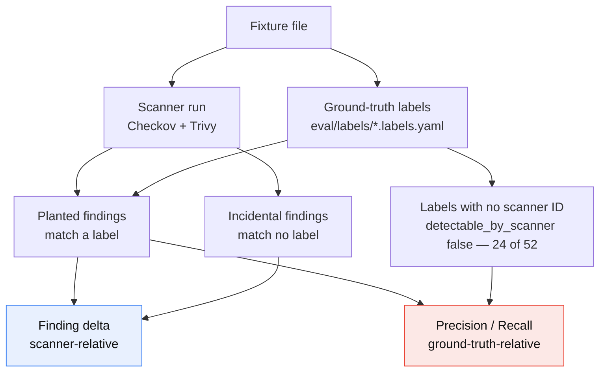

# Evaluation Methodology

**Status:** protocol frozen; results pending the first full run.
**Scope:** how this project measures whether the LLM pipeline actually works, what each number
means, what its denominator is, and what it cannot tell you.

> **Reading this document.** Every number below is tagged. `MEASURED` numbers were produced by
> running the tools on this machine and can be reproduced with the commands given in
> [Reproducibility](#7-reproducibility). `PENDING` is a placeholder for a result the harness will
> fill in. `ILLUSTRATIVE` appears only in the worked example in [§9](#9-worked-example-illustrative)
> and is arithmetic on made-up inputs, present to disambiguate a formula — never to describe this
> system's performance. There are no untagged quantitative claims in this document.

---

## 1. Why measurement is the contribution

The pipeline design in this repository is not novel. Detect-then-remediate with an LLM over
Infrastructure-as-Code is well-trodden, and the closest published reference does strictly more than
this project does:

> D. Toprani and V. K. Madisetti, "LLM Agentic Workflow for Automated Vulnerability Detection and
> Remediation in Infrastructure-as-Code," *IEEE Access*, vol. 13, 2025.
> DOI [10.1109/ACCESS.2025.3560911](https://doi.org/10.1109/ACCESS.2025.3560911)

That work uses retrieval-augmented generation and multi-agent orchestration on Amazon Bedrock. This
project has neither: no RAG, no multi-agent orchestration, one model, one prompt chain, plus a
bounded refinement loop. On architecture, the reference work wins.

Where it is weak is measurement, and that weakness is representative of the area. It evaluates on
10 CloudFormation templates with a single annotator and reports roughly 85% detection with about
15% false positives. Ten templates and one annotator cannot separate a real capability from the
annotator's expectations, and a detection rate quoted without a stated denominator is not a
measurement — it is a summary of an opinion.

This project's own first version was worse. The original submitted report claimed "high detection
accuracy" with no numbers, no denominator, no dataset size and no baseline, and it did so while the
validation step was silently broken in three separate ways (see [ERRATA.md](../ERRATA.md)):

- Checkov was invoked as `python3 -m checkov`. The package ships no `__main__` module, so this
  fails on every Python version. The validation subprocess never executed once.
- Empty stdout from that failed subprocess was caught and returned as
  `"Checkov ran successfully but returned no JSON output (no issues found)."` A tool that never ran
  was reported as a clean pass.
- Remediated Dockerfiles were written to `outputs/fixed/fixed.tf`. Both scanners select their
  Dockerfile rulesets by filename, so Dockerfile rules never applied to Dockerfile output.
  `MEASURED` — the same Dockerfile content yields 0 findings when named `.tf` and 6 when named
  `Dockerfile`.

Three independent bugs, all failing in the same direction: toward a clean result. That is not
coincidence. It is what happens when a system has no measurement that can come back negative.
Nothing in the original harness was capable of producing a number the authors would have had to
explain.

So the contribution here is the part the reference work and the original submission both skip: a
protocol with stated denominators, a ground-truth file that is separate from the code being scored,
a baseline the LLM has to beat, a failure mode (semantic drift) that the headline metric is
structurally blind to, and a threats-to-validity section that is longer than the results section.

The claim this document supports is narrow and I want it stated plainly up front: *on six synthetic
AWS fixtures, with these caveats, the pipeline moves these numbers by this much.* It is not
"detects IaC vulnerabilities with high accuracy." The methodology is the deliverable; the numbers
it produces are small and heavily qualified, and saying so is the point.

---

## 2. The corpus

Six hand-authored fixtures live in [`samples/`](../samples). Four are Terraform, two are
Dockerfiles.

### 2.1 Composition

| Fixture | Type | Lines | `resource` blocks | Comment lines | Checkov failed | Trivy findings | Planted labels | of which scanner-detectable |
|---|---|---:|---:|---:|---:|---:|---:|---:|
| `vulnerable_main.tf` | Terraform | 152 | 8 | 36 | 37 | 23 | 12 | 9 |
| `s3_public.tf` | Terraform | 4 | 1 | 0 | 8 | 10 | 1 | 1 |
| `ec2_open.tf` | Terraform | 38 | 2 | 3 | 8 | 6 | 2 | 2 |
| `vulnerable_network.tf` | Terraform | 37 | 3 | 5 | 7 | 5 | 3 | 3 |
| `docker_insecure.Dockerfile` | Dockerfile | 52 | — | 18 | 5 | 7 | 18 | 7 |
| `vulnerable.Dockerfile` | Dockerfile | 45 | — | 14 | 5 | 6 | 16 | 6 |
| **Total** | | **328** | **14** | **76** | **70** | **57** | **52** | **28** |

`MEASURED` — structural counts from the fixture files; scanner counts from Checkov 3.2.489 and
Trivy 0.68.1 on Python 3.13.14; label counts from the committed files in
[`eval/labels/`](../eval/labels). "Comment lines" counts whole-line and inline `#` comments together.

**The recall denominator is 52.** Two things about that number are worth stating before any result
is quoted.

First, the relationship between labels and findings inverts between the two file types. Terraform
fixtures produce far more findings than labels — `s3_public.tf` is 1 label against 8 Checkov
findings — because policy rulesets fire once per missing control. The Dockerfiles invert it: 18
labels against 5 Checkov findings on `docker_insecure.Dockerfile`, because Dockerfile policy
coverage is thin and most of what is wrong with that file (baked-in secrets, `curl | sh`, a SUID
binary, a running sshd) is not expressible as a Dockerfile lint rule. Neither ratio is a bug; they
are two different things being counted.

Second, and consequently: **24 of the 52 planted labels are detectable by neither scanner**
(`detectable_by_scanner: false`), and 21 of those 24 are in the two Dockerfiles — the remaining 3
are in `vulnerable_main.tf`. That subset is the
entire headroom available to the LLM over the static baseline — it is precisely the set of flaws
that B3 in [§6](#6-baselines-and-ablations) asks whether the model can reach. It is also why the
Dockerfile fixtures matter disproportionately to this evaluation despite being the smallest files
in the corpus.

**70 and 57 are not counts of distinct flaws, and the two do not sum to 127.** They are counts of
*rule violations*. One planted flaw trips many rules: a single public S3 bucket fails separate
checks for ACL, public access block, encryption, versioning, logging, and lifecycle policy. The two
scanners also overlap heavily on the same flaws under different IDs. Treating either number as a
vulnerability count — or adding them — inflates the corpus by an unknown factor. The recall
denominator is the planted-label count, which is 52, and it comes from the ground-truth files, not
from any scanner.

### 2.2 These fixtures are synthetic, and that is a real limitation

Every fixture is vulnerable by design, written by the project authors to be scanned. That has three
consequences worth stating before any result is quoted:

1. **Flaw density is unrealistic.** `s3_public.tf` is four lines and trips 8 Checkov checks. Real
   Terraform is mostly correct with a few problems in it. A pipeline tuned on files where every
   line is wrong may behave very differently on a repository where 2% of lines are wrong, and this
   corpus cannot detect that difference.
2. **The flaws are the textbook ones.** Public ACL, `0.0.0.0/0` ingress, hardcoded password,
   unencrypted volume, wildcard IAM. These are exactly the cases most represented in scanner
   rulesets and in the model's training data. Performance here is close to a best case.
3. **No negative controls.** There is no correctly-written fixture in the corpus. Without one, the
   false-positive rate is measured only in the presence of real flaws, and the pipeline's tendency
   to invent problems in clean code is entirely unmeasured. Adding hardened counterparts to each
   fixture is the single highest-value corpus change available and is tracked as future work.

### 2.3 Label leakage: the fixtures contain their own answer key

This is the most important methodological problem in the corpus, and it exists because the fixtures
were written as teaching examples before anyone intended to score a model on them.

`vulnerable_main.tf` annotates its own planted flaws inline:

```hcl
acl    = "public-read"        # <- public-read is insecure
cidr_blocks = ["0.0.0.0/0"]   # <- insecure: SSH open to world
encrypted   = false           # <- unencrypted root volume
password = "Password123!"     # <- hardcoded secret
publicly_accessible = true    # <- RDS publicly accessible (dangerous)
```

`MEASURED` — 7 such `# <-` markers in `vulnerable_main.tf`, plus 6 numbered section headers
(`# 1) Public S3 bucket (public-read ACL + public policy)` and so on) that name each flaw cluster
before the code that contains it.

A detection score measured on files in this state is contaminated. The model is not being asked to
find the flaws; it is being asked to read the comments and restate them. Recall on
`vulnerable_main.tf` as-written has an obvious ceiling and an obvious floor, and neither tells you
anything about detection.

The contamination is not uniform, which is useful:

| Fixture | Annotation style | Leakage |
|---|---|---|
| `vulnerable_main.tf` | 7 explicit `# <- ... is insecure` markers, 6 numbered flaw-cluster headers | Severe |
| `docker_insecure.Dockerfile` | 15 numbered items, each naming its flaw | Severe |
| `vulnerable.Dockerfile` | 13 numbered items, each naming its flaw | Severe |
| `vulnerable_network.tf` | 2 descriptive inline comments, no numbering | Moderate |
| `ec2_open.tf` | 3 inline comments, one of which explains the flaw | Moderate |
| `s3_public.tf` | none | **None — natural control** |

`MEASURED` — annotation counts from the fixture files.

`s3_public.tf` carries zero comments. It is the one fixture where a detection number is clean
as-written, and for that reason it is the fixture used in the worked example in [§9](#9-worked-example-illustrative).

**The contamination is worst exactly where it matters most.** The three severely-annotated fixtures
carry 46 of the 52 planted labels `MEASURED`, and the two Dockerfiles — which between them hold 21
of the 24 labels no scanner can detect ([§2.1](#21-composition)) — annotate every single one of
their flaws in a numbered comment directly above the offending instruction. The subset of the corpus
that would demonstrate the LLM's value over the static baseline is the subset whose answers are
written in the margin. Any detection result on the commented variants is therefore not merely
inflated; it is inflated precisely where the interesting claim lives. This is the strongest argument
for the stripped variants being the headline, and it is why an unstripped run is not reported as a
result at all.

**Mitigation — comment-stripped variants.** `eval/strip_comments.py` produces a `stripped/` variant
of each fixture with comments removed and code preserved:

- Terraform: whole-line and trailing `#` and `//` comments, and `/* */` blocks, removed. Hash
  characters inside string literals and heredocs are *not* comments and must survive — stripping
  them would change the resource semantics and corrupt both the scanner baseline and the drift
  measurement.
- Dockerfile: whole-line `#` comments removed. The parser directive line, if present, is preserved,
  because it is syntactically a comment but semantically an instruction.

The stripper's correctness condition is mechanical and checked in tests: **the scanner baseline
must be identical before and after stripping.** If Checkov's failed-check count changes when
comments are removed, the stripper altered the infrastructure, not the prose, and the variant is
invalid. This is a cheap, strong invariant — it does not require anyone to eyeball the diff.

| | Commented | Stripped | Invariant |
|---|---|---|---|
| Checkov total | 70 `MEASURED` | 70 `MEASURED` | must equal 70 — **holds** |
| Trivy total | 57 `MEASURED` | 57 `MEASURED` | must equal 57 — **holds** |

The invariant holds exactly, so the stripped corpus is a valid probe: removing the comments
removed prose and nothing else. Reproduce with
`python -m eval.run_eval baseline --variant both`.

**The commented-versus-stripped gap is itself the leakage measurement.** Running detection on both
variants and subtracting gives, for the first time in this project, a number for how much of the
apparent detection capability was reading the answer key:

```
leakage = recall(commented) - recall(stripped)
```

**Measured: 13.5 points** — 52.6% recall on the commented corpus against 39.1% on the stripped
one, over 3 seeds. Roughly a quarter of the model's apparent detection ability was comprehension
of the fixtures' own explanatory comments rather than of the code. A gap near zero would have
meant the model was reading the code; it is not near zero. Either result was publishable and the
favourable one was not assumed.

This is a **lower bound**. Stripping removes comments, not hints: resource names like
`insecure_sg` and string literals inside heredocs still signal the planted flaw. The fixtures
added after this measurement avoid both, so they are uncontaminated by construction rather than
by post-processing — see [§2.1](#21-the-corpus).

**All headline detection numbers in `eval/results/RESULTS.md` are reported on the stripped
variants.** The commented variants are run only to produce the leakage figure.

---

## 3. Ground truth

Detection cannot be scored against a scanner, because "did the LLM agree with Checkov" is a
different question from "did the LLM find the flaw." Ground truth lives in
`eval/labels/<fixture>.labels.yaml`, one file per fixture, authored by hand and version-controlled
separately from the code being scored. Per-fixture authoring notes — including why a given finding
was judged incidental — are in [`eval/labels/README.md`](../eval/labels/README.md); this section
specifies the schema and the rules that bind it.

### 3.1 Schema

The canonical example is the real committed file,
[`eval/labels/s3_public.labels.yaml`](../eval/labels/s3_public.labels.yaml):

```yaml
schema_version: 1
fixture: samples/s3_public.tf
framework: terraform
labels:
  - id: S3-BUCKET-PUBLIC-READ-ACL
    resource: aws_s3_bucket.example
    lines: [3]
    description: "S3 bucket grants public READ through a public-read canned ACL"
    category: public-exposure
    severity_expected: critical
    checkov_ids: [CKV_AWS_20]
    trivy_ids: [AVD-AWS-0092]
    detectable_by_scanner: true
    aliases:
      - "public-read acl"
      - "publicly readable bucket"
      - "public s3 bucket"
      - "acl = \"public-read\""
      - "bucket acl allows public access"
```

`MEASURED` — `CKV_AWS_20` appears in this fixture's Checkov output and `AVD-AWS-0092` in its Trivy
output; both were re-verified against live scanner runs while writing this document, per
[§3.2](#32-scanner-ids-are-copied-from-output-never-written-from-memory).

**Note the label count: one.** This four-line fixture produces 8 Checkov and 10 Trivy findings
`MEASURED` but carries exactly **one** planted flaw. The other findings are omissions of controls
the file never claimed to configure — versioning, logging, KMS encryption, replication, lifecycle,
event notifications, public-access-block — and are incidental by the rule in
[§4](#4-planted-versus-incidental-findings). A one-label file is the honest answer here, not an
oversight, and padding it to eight would make recall trivially easy to score well on.

| Field | Type | Meaning |
|---|---|---|
| `schema_version` | int | Bumped on any breaking schema change; the loader rejects versions it does not know rather than guessing. |
| `fixture` | path | Repo-relative path to the file this label set describes. |
| `framework` | enum | `terraform` \| `dockerfile`. Matches `IaCType`. |
| `id` | string | Stable label identifier, unique within the file. Descriptive rather than numeric (`S3-BUCKET-PUBLIC-READ-ACL`, not `S3-001`) so a results table row is readable without opening the labels file. |
| `resource` | string | Terraform address `type.name` (`aws_s3_bucket.example`); for Dockerfiles, the instruction text (`FROM python:3.10-slim`, `RUN apt-get install`) or a pseudo-resource naming the artifact the flaw belongs to (`image`). The join key against `Finding.resource` and `extract_resources()`. Dockerfiles have no addressable resources, so this is a naming convention rather than a real identifier — a known soft spot in the matcher. |
| `lines` | [int] | The specific lines carrying the flaw in the *original* fixture — not a span. May be a single line `[4]`, several non-contiguous lines `[123, 127, 129]`, or empty `[]` for a whole-file property such as a missing `USER` instruction. Advisory: used for reporting, never for matching, because remediation moves lines. |
| `description` | string | What is wrong, in prose. Written to be readable by someone who is not looking at the file. |
| `category` | enum | Flaw class. Seven values in use across the corpus `MEASURED`: `public-exposure`, `network-open`, `secrets`, `encryption`, `iam-overprivilege`, `container-hardening`, `supply-chain`. Used for aggregate breakdowns by flaw class. |
| `severity_expected` | enum | `critical` \| `high` \| `medium` \| `low`. The label author's judgement. Deliberately not compared to scanner severity — the two use different scales, and forcing agreement would be a fake metric. |
| `checkov_ids` | [string] | Checkov check IDs that fire on this flaw. **Copied from real scanner output.** |
| `trivy_ids` | [string] | Trivy rule IDs that fire on this flaw. **Copied from real scanner output.** |
| `detectable_by_scanner` | bool | True if either ID list is non-empty. Redundant, and deliberately so: it is the field that makes "flaws only a human or an LLM would catch" a queryable subset rather than an anecdote. 28 of 52 labels are true `MEASURED`. |
| `aliases` | [string] | Lowercase surface forms an LLM might use for this flaw. The matching vocabulary — see [§5.2](#52-metric-2--detection-precision-and-recall). |

### 3.2 Scanner IDs are copied from output, never written from memory

**Rule: every value in `checkov_ids` and `trivy_ids` must be pasted from the output of an actual
scanner run on that fixture. No ID may be typed from recall, inferred from a rule name, or
retrieved from a model.** The harness enforces the weak half of this automatically: at load time it
verifies that every ID listed in a label file appears somewhere in that fixture's scanner baseline,
and fails the run otherwise. It cannot verify that the ID is attached to the *right* label, so the
authoring discipline still matters.

The reason is specific and local. The originally submitted project report contains a results table
whose policy IDs do not correspond to the policies described alongside them — the IDs were written
from memory, they look plausible, they are internally consistent, and they are wrong. An ID like
`CKV_AWS_20` is exactly the kind of token that is easy to half-remember and impossible to spot-check
by eye. Anyone who trusted that table and went looking for the named policy would have found a
different policy entirely.

That failure is cheap to prevent and expensive to discover late, so the rule is absolute. Where IDs
have not yet been collected, the field is left empty with a `FILL FROM SCANNER OUTPUT` marker rather
than filled with a plausible guess. **This document prints no Checkov or Trivy ID that was not
verified against a live scanner run while writing it** — including in examples, because an ID that
appears in documentation gets copied out of it.

Collection command:

```bash
.venv/bin/iac-agent scan samples/s3_public.tf --scanner checkov --json | jq -r '.failed[].rule_id'
.venv/bin/iac-agent scan samples/s3_public.tf --scanner trivy   --json | jq -r '.failed[].rule_id'
```

The full ID set for `s3_public.tf`, `MEASURED` on Checkov 3.2.489 and Trivy 0.68.1, is 8 and 10
IDs respectively — matching the 8 and 10 finding counts in [§2.1](#21-composition). Exactly one
Checkov ID and one Trivy ID from those sets are attached to the single planted label; the other 16
belong to incidental findings and appear in no label file.

### 3.3 Single annotator

The labels have one author. There is no second annotator and therefore no inter-annotator
agreement statistic. This is the same weakness the IEEE Access reference work has, and this project
does not fix it — it discloses it, keeps the labels in a separate reviewable file so a second
annotator could be added without touching code, and treats every precision/recall figure as
conditional on one person's judgement about what counts as a flaw. See [§8](#8-threats-to-validity).

---

## 4. Planted versus incidental findings

A scanner run on a fixture produces two kinds of finding, and they belong to different metrics.

**Planted** — a finding that corresponds to a label in the ground-truth file. These were put there
on purpose.

**Incidental** — a real rule violation that nobody planted. `s3_public.tf` is four lines long and
declares one bucket with a public ACL; Checkov reports 8 failed checks on it `MEASURED`, because a
bucket with no versioning block, no logging block, no encryption block and no public-access-block
resource violates those policies too. Those are genuine findings. They are not what the fixture was
written to test.

The rule:

> **Planted flaws form the recall denominator. Incidental findings are excluded from precision and
> recall, but they are fully counted in the before/after delta.**

This is not a convenience. The two metric families are relative to different reference frames:

- **The delta is scanner-relative.** It asks: did the remediated file trip fewer rules than the
  original? Every rule violation counts, planted or not, because the scanner does not know the
  difference and neither does a user running the tool on their own repository. Excluding incidental
  findings from the delta would mean reporting a security improvement the scanner does not see.
- **Precision and recall are ground-truth-relative.** They ask: did the LLM find the specific things
  a human labelled as flaws? Counting incidental findings here would make the denominator a
  property of the scanner's ruleset rather than a property of the file, and the metric would move
  whenever Checkov shipped a new policy — even though the fixture never changed.

Mixing them produces the classic bad number: recall computed against a scanner-derived denominator,
which measures agreement with the scanner and is then reported as detection accuracy.



One consequence worth naming: labels with `detectable_by_scanner: false` are in the recall
denominator but can never appear in the delta. If the LLM catches those and the scanners cannot,
recall rises while the delta does not move at all. That divergence is a signal, not a bug — it is
the shape the numbers take when the LLM is contributing something the static tools miss, and it is
the only place in this protocol where that contribution becomes visible.

---

## 5. The four metrics

Notation. `F` is the set of fixtures. `S` is the set of scanners, `{checkov, trivy}`. For a fixture
`f` and scanner `s`, `before(f,s)` is the scan of the original fixture and `after(f,s)` is the scan
of the pipeline's final output. Findings are compared by `Finding.key()`, which is the tuple
`(rule_id, resource)` — the identity defined in `iac_agent/types.py`.

### 5.1 Metric 1 — Finding delta (headline)

Per scanner, over the whole corpus:

```
B_s = sum over f in F of |before(f,s).failed|
A_s = sum over f in F of |after(f,s).failed|

finding_delta(s) = (B_s - A_s) / B_s
```

`B_checkov = 70` and `B_trivy = 57` `MEASURED`. These are the fixed denominators; they do not
change between runs unless the fixtures or the scanner versions change.

Reported alongside it, always, and **never netted against it**, computed on key sets:

```
resolved(f,s)   = | before(f,s).keys() - after(f,s).keys() |
introduced(f,s) = | after(f,s).keys()  - before(f,s).keys() |
persisted(f,s)  = | before(f,s).keys() & after(f,s).keys()  |
```

The reason for the "never netted" rule is semantic. A run that resolves 40 findings and
introduces 10 nets out to roughly the same headline as one that resolves 30 and introduces 0 —
but those are very different outcomes, because the first wrote *new* misconfigurations into the
user's infrastructure. A single netted number cannot distinguish them, so `introduced` is a
first-class column in every results table and is never folded into the headline.

> **Note on units.** `B` and `A` are finding **counts**; `resolved` and `introduced` are
> **key-set** cardinalities. It is tempting to write `B - A = resolved - introduced`, but that
> identity holds only when no two findings share a key, and on this corpus they do — `Finding.key()`
> collides on 4 of 12 scanner-fixture combinations, all in Trivy output (see
> [§8, threat T8](#8-threats-to-validity) and `docs/LLD.md` §7.8). `DS031` fires three times on
> three different lines of `vulnerable.Dockerfile` and collapses to one key. Treat counts as the
> measure of *how much* changed and key sets as the record of *which* findings changed; do not
> mix them in one equation.

> **Results live in [`eval/results/RESULTS.md`](../eval/results/RESULTS.md) §2**, generated by
> `python -m eval.run_eval report`. They are deliberately not mirrored here. This document
> defines *how* the delta is computed; duplicating the values would create a second, hand-kept
> copy that goes stale — which is precisely how the superseded report acquired a results table
> describing policies that do not exist ([`ERRATA.md`](../ERRATA.md) E2). The fixed denominators
> are Checkov 70 and Trivy 57.

**Known weakness of the key.** `(rule_id, resource)` is not stable under renaming. If the model
renames `aws_s3_bucket.example` to `aws_s3_bucket.secure_bucket` while fixing it, every finding on
that resource appears as one resolved and one introduced, and the delta is unchanged but both
companion counts are inflated. This is a real and expected artifact, not a hypothetical: renaming
during a rewrite is common LLM behaviour. It is why `resolved` and `introduced` are read *together
with* the drift report ([§5.4](#54-metric-4--semantic-drift)) rather than on their own, and why the
drift report's `renamed` field exists. A results table showing high `introduced` with high `renamed`
means something different from high `introduced` with zero `renamed`.

### 5.2 Metric 2 — Detection precision and recall

Scored against the labels, on the **comment-stripped** variants.

**Matching.** An LLM finding `d` matches a label `L` when both hold:

1. **Resource match.** For Terraform, `normalise(d.resource)` equals `normalise(L.resource)`, where
   `normalise` lowercases, strips quotes, strips a leading `resource ` keyword, and accepts either
   `type.name` or `type "name"` spelling. For Dockerfiles there is no address space, so the rule is
   weaker: the leading instruction keyword must match (`RUN` to `RUN`, `ENV` to `ENV`), or the label
   must use a whole-image pseudo-resource, in which case the resource check is skipped and the
   semantic check alone decides. Dockerfile matching is therefore materially less precise than
   Terraform matching, and Dockerfile precision figures should be read with that discount applied.
2. **Semantic match.** The concatenation of `d.issue` and `d.recommendation`, lowercased, contains
   at least one string from `L.aliases`.

The `aliases` list is the weak point of this metric and I would rather say so than hide it. Substring
matching against a hand-written vocabulary will miss a correct finding phrased in a way the label
author did not anticipate — that miss is scored as a false negative *and* a false positive, which is
the worst possible failure for a scoring function. Two controls: aliases are written before results
are looked at, and every unmatched finding is manually reviewed in the adjudication pass below,
where a phrasing miss is caught and the alias list amended. An amendment always triggers a full
rerun so that no result is ever produced by a vocabulary that was tuned against it.

**Counting.** Two units, because recall and precision have different natural ones. Both are defined
explicitly so that `TP` is never ambiguous:

```
TP_label   = number of labels matched by at least one finding
FN         = number of labels matched by no finding          =  |labels| - TP_label
TP_finding = number of findings matching at least one label
FP_strict  = number of findings matching no label            =  |findings| - TP_finding

recall            = TP_label / |labels|
precision_strict  = TP_finding / |findings|
```

Recall is label-wise so that reporting the same flaw three times cannot inflate it. Precision is
finding-wise so that verbose output is penalised, which is the behaviour we want to discourage.

**False positives are reported two ways.** `precision_strict` treats every unmatched finding as
wrong. That is too harsh: an unmatched finding may be a genuine misconfiguration the label author
missed, and penalising the model for being more thorough than the annotator measures the annotator.
So each unmatched finding is adjudicated by hand into exactly one of three buckets:

| Bucket | Meaning | Effect |
|---|---|---|
| `real_unlabelled` | A genuine flaw in the fixture, absent from the labels. | Counted as correct in `precision_adjudicated`; a new label is added and the run repeated so it counts normally thereafter. |
| `phrasing_miss` | Correctly identifies a labelled flaw in words no alias covers. | Alias list amended, full rerun. Never counted as a win without the rerun. |
| `hallucination` | Describes a flaw that is not present in the file. | Counted as a false positive in both figures. |

```
precision_adjudicated = (TP_finding + |real_unlabelled|) / |findings|
```

Both figures are published, and the adjudication bucket counts are published with them, because
`precision_adjudicated` is a number produced by the system's author judging the system's output and
it should be read with that in mind. `precision_strict` is the defensible floor;
`precision_adjudicated` is the more informative but less trustworthy figure. The gap between them is
a measure of how incomplete the labels were.

> **Results in [`eval/results/RESULTS.md`](../eval/results/RESULTS.md) §3**, both variants, with
> the adjudication bucket counts alongside.

The label denominator is fixed at 52 for both variants — stripping comments removes prose, not
flaws, so the ground truth is identical across them. That is what makes the two rows subtractable,
and therefore what makes the leakage figure meaningful.

### 5.3 Metric 3 — Validity rate

```
validity_rate = (number of generated outputs that parse) / (number of generated outputs)
```

"Parses" is `check_validity()` in `iac_agent/validity.py`: an `hcl2` parse for Terraform, a
structural check for Dockerfiles that requires a `FROM` instruction as the first non-comment
directive and rejects unknown leading instructions.

**Measured on raw model output, before the loop's validity gate.** This is the part that is easy to
get wrong. `run_loop()` refuses to accept a fix that does not parse, so validity measured on
*accepted* outputs is 100% by construction and means nothing. The harness therefore records the
validity of every generation attempt, including ones the loop discarded. A run that produced four
invalid drafts before a valid one has a validity rate of 20%, not 100%, and that is the number that
tells you something about the model.

**This is a syntax gate, not `terraform validate`.** `hcl2` parses the grammar. It does not resolve
references, so `aws_s3_bucket.deleted_bucket.id` still parses after the bucket has been deleted. It
does not check provider schemas, so an invented argument name parses. It does not check required
arguments, types, or count/for_each semantics. A file can pass this gate and fail `terraform
validate`, and a file can pass `terraform validate` and fail `terraform plan`. Running the real
thing needs a provider download and, for plan, credentials and state — out of scope for an offline
harness, and named as a threat in [§8](#8-threats-to-validity).

> **Results in [`eval/results/RESULTS.md`](../eval/results/RESULTS.md) §5**, split by framework.

### 5.4 Metric 4 — Semantic drift

This is the measurement that differentiates this evaluation, so it gets the most space.

**The failure mode, in plain terms.** Ask a model to fix a publicly-accessible RDS instance with a
hardcoded password. One valid-looking response is to delete the `aws_db_instance` block. Every
finding on that resource disappears. The finding delta is perfect. The file parses. Precision and
recall may even look fine, because the model correctly *described* the flaw before removing the
resource that had it. And the user has just destroyed their production database.

Every metric above is blind to this. The delta actively rewards it — deletion is the highest-scoring
possible "fix" for any resource. A pipeline optimised against the delta alone converges on deleting
infrastructure, and the evaluation would report that as a success. Drift is the metric that makes
that visible.

**How it is computed.** `compute_drift()` in `iac_agent/validity.py` extracts the set of resource
addresses `(type, name)` from the before and after files via `extract_resources()` and returns a
`DriftReport`:

| Field | Definition |
|---|---|
| `deleted` | Addresses in before, absent from after. |
| `added` | Addresses in after, absent from before. |
| `renamed` | Heuristic pairing: same resource type, instance count for that type unchanged, name differs. Reported separately so a rename is not silently scored as a delete plus an unrelated add. |
| `type_count_drops` | Resource types whose instance count decreased, as `{type: (before, after)}`. Catches the case where one of three security groups vanished but the type is still present, which a set difference over addresses alone under-weights. |
| `drifted` | Derived **property**, not a stored field: `bool(deleted or type_count_drops or renamed)`. Computed rather than stored so a flag can never disagree with the lists it summarises. |

A rename is definitionally a deletion plus an addition, so a renamed resource appears in `deleted`,
`added` and `renamed` simultaneously. `DriftReport.summary()` un-double-counts for display; the
raw lists do not, which matters when reading the totals table below.

**Renames count as drift.** This is not obvious and it is deliberate: Terraform state keys on the
resource address, so renaming `aws_db_instance.bad_rds` to `aws_db_instance.secure_rds` destroys and
recreates the database on the next apply. The file looks fine and the infrastructure is gone. A
rename is a destructive operation wearing a cosmetic disguise, which is exactly the class of failure
this metric exists to surface.

**Additions alone do not set `drifted`, equally deliberately.** Fixing a public bucket correctly
*requires* adding `aws_s3_bucket_public_access_block` and
`aws_s3_bucket_server_side_encryption_configuration`. A metric that flagged those as drift would
penalise the correct fix and reward the lazy one. `added` is still reported, because a fix that adds
fourteen resources is worth looking at even though it is not destructive.

```
drift_rate          = (outputs where DriftReport.drifted) / (total outputs)
flaw_touching_drift = number of outputs where drift_touches_flaw(...) returns a non-empty list
```

`drift_touches_flaw(drift, flagged_resources)` takes the set of `Finding.resource` values from the
**pre-remediation scan** — every resource that carried at least one finding — and returns the sorted
subset of them whose address was deleted or renamed. Note that this is scanner-relative rather than
label-relative: it asks "which resources that had findings stopped existing", which is the right
question, because the finding delta is also scanner-relative and this is the metric that audits it.

It returns a list rather than a boolean so `RESULTS.md` can name the specific casualties instead of
reporting a count nobody can act on. Resource matching tolerates Checkov's
`module.db.aws_db_instance.main` prefixing by also trying the trailing two segments.

This is the number that matters most in the entire document. Drift on an incidental resource is
sloppy; drift on a resource that carried findings is the exact "fixed it by deleting it" pathology,
and it means the corresponding contribution to the finding delta is fraudulent.

> **Results in [`eval/results/RESULTS.md`](../eval/results/RESULTS.md) §6**, which lists every
> drift event individually rather than only counting them — a rate hides which resource was lost,
> and that is the part a reader needs in order to judge whether the fix was real.
>
> The drift rate is quoted over **Terraform** outputs only. A Dockerfile has no addressable
> resources and so can never drift; including Dockerfiles in the denominator would dilute the
> rate with outputs structurally incapable of moving it.

**Honest limits of address-level drift.** This is a weaker instrument than a real `terraform plan`
diff, and the gap is not small:

- It sees resources, not arguments. A model that keeps `aws_db_instance.bad_rds` but silently
  changes `allocated_storage` from 20 to 5, drops `engine`, or removes an `ingress` rule the
  application depended on registers **zero drift**. Argument-level drift is invisible to it.
- It cannot tell a security-necessary removal from a destructive one. Deleting an
  `aws_s3_bucket_policy` that granted `Principal: "*"` is the correct fix and is scored as drift;
  deleting the bucket is a disaster and is scored identically. The `flaw_touching_drift` split
  narrows this but does not resolve it — both cases touch a finding-carrying resource. Every drift
  event is therefore listed individually in `RESULTS.md`, not just counted, so a reader can judge.
- The `renamed` heuristic is exactly that. Same type plus stable count plus different name is a
  guess, and it will mispair two resources of the same type that were both renamed.

A real `terraform plan` against recorded state would catch all of it. That needs a provider
download, credentials, and state files, none of which belong in an offline harness that runs in CI
with no cloud account. Address-level drift is the strongest signal available under that constraint,
and quoting it as anything more than that would be the same overclaiming this document exists to
correct.

---

## 6. Baselines and ablations

A number with no baseline is not a result. Each row below states what it establishes and what it
would take to falsify the corresponding claim.

| # | Condition | Establishes | Status |
|---|---|---|---|
| B1 | Checkov alone | Static floor for policy-style rules. | 70 `MEASURED` |
| B2 | Trivy alone | Independent static floor, different ruleset lineage. | 57 `MEASURED` |
| B3 | LLM vs. scanner **union** | Whether the LLM finds anything the static tools cannot. | Measured — [RESULTS.md §1, §3](../eval/results/RESULTS.md) |
| B4 | Commented vs. stripped | Magnitude of label leakage. | Measured — [RESULTS.md §3](../eval/results/RESULTS.md) |
| B5 | Loop vs. no-loop | Whether iteration helps. | Vacuous today — see below |

**B1 / B2.** These are the numbers the pipeline has to justify itself against. Checkov and Trivy run
in under a second, need no API key, cost nothing, and between them find 70 and 57 rule violations in
this corpus. Any claim on behalf of an LLM pipeline that costs money, takes seconds per file, and
can hallucinate has to be a claim about something these two do not already do.

**B3 is the only honest basis for "the LLM finds things scanners cannot."** The comparison must be
against the *union* of both scanners, not against either alone. Comparing against Checkov alone
would credit the LLM for every flaw Trivy already catches for free — a real trap, since the two
rulesets diverge substantially on both Terraform and Dockerfiles. Concretely:

```
scanner_union_labels = { L in labels : L.checkov_ids != [] or L.trivy_ids != [] }
llm_only_labels      = { L in labels : L matched by the LLM and L not in scanner_union_labels }
```

`|llm_only_labels|` is the increment, and its ceiling is known in advance: **24** `MEASURED` — the
labels with `detectable_by_scanner: false` ([§2.1](#21-composition)). The scanners have already
claimed the other 28, so 24 out of 52 is the largest recall contribution the LLM could possibly make
that the static tools do not already provide for free.

The composition of that ceiling is informative and slightly awkward for the project: 21 of the 24
are in the two Dockerfiles, concentrated in `container-hardening`, `secrets` and `supply-chain` —
baked-in credentials, `curl | sh`, SUID binaries, a running sshd. Only 3 are Terraform. So if this
pipeline demonstrates value over the static baseline on this corpus, it will overwhelmingly be
Dockerfile value, and a headline framed around Terraform would misrepresent where the gain came
from. If `|llm_only_labels|` is zero, the correct conclusion is that on this corpus the LLM adds
nothing a scanner did not already provide, and that conclusion will be reported as readily as any
other.

**B4** is described in [§2.3](#23-label-leakage-the-fixtures-contain-their-own-answer-key).

**B5 is vacuous right now and calling it an ablation would be dishonest.** The pipeline as
originally submitted is linear: detect, fix, write, validate, stop. Nothing consumes the validation
result. "Loop disabled" and "loop enabled" therefore describe the same computation, and an ablation
table comparing them would show a difference of zero dressed up as a finding.

It becomes a real experiment only once `run_loop()` exists and closes the feedback path — rescan the
fix, distil the remaining failures, feed them back, re-fix, and stop on one of `CONVERGED`,
`MAX_ITERS`, `NO_PROGRESS`, or `TOKEN_BUDGET`, always returning the best-so-far state rather than
the last attempt. At that point the comparison has content: iterations to convergence, marginal
findings resolved per additional iteration, token cost per marginal finding, and — the one worth
watching — whether drift *increases* with iteration count as the model runs out of legitimate fixes
and starts deleting things to satisfy the scanner.

This is also the only place the word "agentic" is earned. A straight-line detect-then-fix chain is a
pipeline; the original report called it an agentic workflow and it was not one. A bounded loop that
observes its own output through a scanner, decides whether to continue, and terminates on an
explicit stop condition is the thing that makes the term meaningful, and the distinction is not
cosmetic — it is the difference between B5 being an experiment and being a blank row.

> **Not yet run.** This is the one experiment in this document that has no numbers behind it, and
> it is listed here as designed-but-unmeasured rather than quietly dropped.
>
> It is now a *real* experiment — it was vacuous while the pipeline was a straight line, because
> removing a feedback edge that fed into nothing changed no output. With the loop implemented,
> comparing `--max-iters 1` against `3` and `5` measures whether iteration actually buys
> anything or merely spends tokens. Running it costs roughly one extra full evaluation
> (~$0.50 at gpt-4o-mini rates) and needs no new code:
>
> ```bash
> for n in 1 3 5; do python -m eval.run_eval run --fresh --max-iters "$n" --out "eval/results/ablation-$n.json"; done
> ```
>
> The columns it would fill: iterations to converge, findings resolved, introduced, drift rate,
> tokens. Until then, no claim is made in either direction about whether the loop helps.

---

## 7. Reproducibility

The target is that anyone can regenerate every number in `eval/results/RESULTS.md` from a clean
checkout, offline, with no API key and no spend.

### 7.1 Pinned configuration

| Parameter | Value | Why pinned |
|---|---|---|
| Model | `gpt-4o-mini-2024-07-18` | A dated snapshot, not the `gpt-4o-mini` alias. Aliases are repointed by the provider, which silently invalidates every historical result. |
| `temperature` | `0` | Minimises sampling variance. |
| `seed` | `42` | Requests reproducible sampling where the provider supports it. |
| `prompt_version` | integer in `ModelConfig` | Bumped on any prompt edit. Results are only comparable within a prompt version, and the version is printed in every results table. |
| Checkov | `3.2.489` | Rulesets change between releases; an unpinned scanner makes the 70/57 baseline meaningless. |
| Trivy | `0.68.1` | Same. |
| Python | `3.13.x` | Checkov 3.2.489 crashes on 3.14 (a `networkx` 3.6 dataclass-slots incompatibility). 3.11–3.13 work. |
| `bc-python-hcl2` | `0.4.3` | Ships as a Checkov dependency and parses all four Terraform fixtures. |

`MEASURED` — versions read from the project virtualenv at `.venv/`.

### 7.2 Cache keys and the committed response cache

Every model call is keyed by a SHA-256 over the tuple that fully determines the response:

```
key = sha256(
    model_snapshot,               # "gpt-4o-mini-2024-07-18"
    temperature, seed,
    prompt_version,               # integer from ModelConfig
    task,                         # "detect" | "fix" | "distill"
    fixture_variant,              # "commented" | "stripped"
    sha256(rendered_prompt_text), # the exact bytes sent to the model
    repeat_index,                 # 0 .. R-1
)
```

Including `sha256(rendered_prompt_text)` rather than just the fixture path means any change to a
prompt template, a fixture, or the distilled feedback text produces a different key. A stale cache
entry can therefore never be served for a prompt it was not generated from — the common and
hard-to-notice failure in hand-rolled LLM caches. `repeat_index` keeps the repeat runs
([§7.4](#74-repeats-and-what-the-spread-means)) distinct rather than collapsing to one cached
answer.

Responses are stored as JSON under `eval/cache/` and **committed to the repository.** That is a
deliberate trade: it adds noise to the repo in exchange for the property that a reviewer with no
OpenAI account can reproduce the published numbers exactly. The cache holds only model responses to
prompts built from public fixtures — no keys, no user data.

### 7.3 Offline regeneration and the fail-closed cache

```bash
.venv/bin/python -m eval.run_eval --offline        # cache only; no network
.venv/bin/python -m eval.metrics                   # recompute tables into eval/results/RESULTS.md
```

In `--offline` mode a cache miss is a **hard error**, not a live call. This is the same fail-closed
principle the scanner layer uses, applied to the evaluation harness: the failure mode being designed
out is a run that appears reproducible while quietly making network calls and spending money, and
which would produce a *different* answer for the next person because their cache miss was filled
from a since-updated model. CI runs `--offline` with no API key configured, so any drift between the
committed cache and the current prompts fails the build rather than being papered over.

### 7.4 Repeats, and what the spread means

`temperature=0` plus a seed **reduces but does not eliminate** non-determinism. Floating-point
reduction order varies with server-side batching, mixture-of-experts routing is not guaranteed
stable across requests, and provider-side infrastructure changes are invisible to the client. Seeds
are documented as best-effort, not as a guarantee. Anyone who has run the same zero-temperature
prompt twice has seen them differ.

That is precisely *why* repeats are run rather than a reason to skip them. Each configuration is
executed `R = 5` times and reported as **mean with [min, max]** in this format:

```
finding_delta(checkov) = <mean> [<min>, <max>]        # ILLUSTRATIVE format only
                       = 0.71  [0.68, 0.74]           # invented values, not a result
```

**These are descriptive statistics, not inferential ones.** Six fixtures and five repeats is far too
small to support confidence intervals, significance tests, or any claim that one configuration
beats another. No p-value, no standard error, and no error bar implying a sampling distribution
appears anywhere in the results. The min–max range is there to answer one question — *how much does
this number move when nothing changes?* — and if the spread turns out to be wide relative to the
difference between two conditions, the honest reading is that this harness cannot distinguish them,
and that is what will be written.

---

## 8. Threats to validity

Ordered roughly by how much they should reduce confidence in the headline numbers.

**T1 — Synthetic corpus.** Every evaluated fixture was written to be vulnerable, by the people
evaluating the tool. Flaw density is far above anything in production, and the flaws are textbook
cases over-represented in both scanner rulesets and model training data. Results transfer to real
Terraform repositories only as a very loose upper bound.

*Partially mitigated since the published run.* Two things changed and neither is reflected in the
numbers above:

- `samples/secure/` now provides **hardened negative controls** — realistic secure IaC scoring
  zero findings from both scanners — so false alarms on correct infrastructure become measurable
  for the first time.
- Six further vulnerable fixtures were added covering Lambda, EKS, KMS/CloudTrail and API
  Gateway/SNS, and unlike the original six they carry **no flaw-naming comments and no
  give-away resource names**, so they are uncontaminated by construction rather than by
  post-processing.

*Still outstanding, and still the highest-value next step: a sample of real-world open-source
Terraform. Synthetic-but-uncontaminated is better than synthetic-and-annotated; it is not the
same as organic.*

**T2 — Sample size.** Six fixtures, 14 Terraform resources, two file types, 52 labels `MEASURED`.
Every per-fixture number is effectively an anecdote, and the corpus is badly unbalanced in two
different directions at once: `vulnerable_main.tf` alone accounts for 37 of the 70 Checkov findings,
while the two Dockerfiles account for 34 of the 52 labels `MEASURED`. The delta is therefore
substantially a report on one Terraform file and recall is substantially a report on two
Dockerfiles. `s3_public.tf` contributes a single label, so its recall is 0.00 or 1.00 with nothing in
between. *Mitigation: per-fixture results are always published alongside totals so this imbalance is
visible rather than averaged away — but no amount of reporting discipline fixes n = 6.*

**T3 — Self-authored flaws and single annotator.** The same person wrote the fixtures, wrote the
labels, and wrote the system being scored. Recall measures agreement between the pipeline and its
own author's expectations. There is no inter-annotator agreement statistic because there is one
annotator. *Mitigation: labels are in separate reviewable YAML with explicit aliases, so a second
annotator can be added without touching code — but until that happens, this is unresolved.*

**T4 — Label leakage.** The fixtures annotate their own flaws. Any detection number on the commented
variants is contaminated. *Mitigation: headline detection is reported on stripped variants only, and
the commented–stripped gap is published as an explicit leakage figure
([§2.3](#23-label-leakage-the-fixtures-contain-their-own-answer-key)). This is the best-handled
threat in the list.*

**T5 — Scanner-relative circularity.** Checkov's output is the remediation target — the refinement
loop feeds distilled Checkov failures back to the model — and Checkov's output is also the headline
score. The delta therefore partly measures "did the model satisfy the grader it was shown", which is
a weaker claim than "did the model make the infrastructure safer." *Mitigation, stated as a design
intention and not yet implemented: hold one scanner out of the feedback path entirely so it scores
blind. Trivy is the natural choice — it is never shown to the model, so its delta is an independent
read. Until that separation is enforced in `run_loop()`, both deltas should be read as partly
in-sample.*

**T6 — No semantic-equivalence check.** Nothing verifies that the remediated file still does what the
original did. `check_validity()` is a syntax gate ([§5.3](#53-metric-3--validity-rate)); drift is
address-level ([§5.4](#54-metric-4--semantic-drift)). No `terraform validate`, no `terraform plan`,
no apply, no runtime test. A fix that is secure, parses, and preserves every resource address can
still be undeployable or functionally broken. *Mitigation: none. This is the largest un-instrumented
gap in the evaluation and it is why drift is reported as a proxy rather than as a guarantee.*

**T7 — AWS-only, two file types.** Every Terraform fixture targets AWS; no Azure, no GCP, no
Kubernetes manifests, no CloudFormation, no Helm. Conclusions do not transfer across providers,
whose resource models and scanner rulesets differ substantially. Note that this also blocks direct
comparison with the IEEE Access reference work, which evaluates CloudFormation — the two result sets
are not commensurable and are not presented as such.

**T8 — Metric instrumentation artifacts.** Three known ones, all documented above:

1. `Finding.key()` is `(rule_id, resource)` and is unstable under resource **renaming**, inflating
   both `resolved` and `introduced` ([§5.1](#51-metric-1--finding-delta-headline)).
2. `Finding.key()` also **collides** — distinct findings from one rule at different lines share a
   key. Measured on 4 of 12 scanner-fixture combinations, all Trivy; `DS031` fires on lines 28, 29
   and 30 of `vulnerable.Dockerfile` and collapses to a single key. Consequence: key-set
   cardinalities systematically *understate* multiplicity, so counts and key sets must never be
   combined in one equation ([§5.1](#51-metric-1--finding-delta-headline)). Both artifacts trace to
   the same deliberate trade — the key excludes line numbers so it survives a rewrite.
3. Alias substring matching will miss correctly-phrased findings, which costs twice — once as a
   false negative, once as a false positive ([§5.2](#52-metric-2--detection-precision-and-recall)).

**T9 — Adjudication is performed by the system's author.** `precision_adjudicated` requires a human
to decide whether an unmatched finding is a real unlabelled flaw or a hallucination, and that human
has an interest in the outcome. *Mitigation: `precision_strict` is published as the defensible
floor, every adjudication bucket count is published, and every promoted label is committed to the
labels file where it can be disputed.*

---

## 9. Worked example (ILLUSTRATIVE)

> **The setup below is real; every model output and every derived score is invented.** The fixture,
> its scanner counts, and its ground-truth labels are `MEASURED` and marked as such. Everything from
> "Step 1 — Detection" onward is `ILLUSTRATIVE` arithmetic on made-up model responses, present only
> to remove ambiguity from the formulas in [§5](#5-the-four-metrics). It is not a result, not a
> prediction, and not an estimate of this system's performance. Real values will appear in
> `eval/results/RESULTS.md`.

**Fixture:** `samples/s3_public.tf`. Chosen because it is four lines long, has zero comments — so it
is the one fixture with no label leakage — and still trips 8 Checkov checks, which makes the
planted-versus-incidental distinction vivid.

```hcl
resource "aws_s3_bucket" "example" {
  bucket = "mybucket"
  acl    = "public-read"
}
```

**Before (`MEASURED`):** Checkov 8 failed checks, Trivy 10 findings.

**Ground truth (`MEASURED`, from the committed labels file):** exactly **1** planted flaw,
`S3-BUCKET-PUBLIC-READ-ACL` on `aws_s3_bucket.example`. The other 7 Checkov findings — versioning,
logging, KMS encryption, replication, lifecycle, event notifications, public-access-block — are
**incidental**: real policy violations, but omissions of controls this four-line file never claimed
to configure, and not what it was written to test.

This 1-versus-8 ratio is the planted/incidental distinction at its starkest, and it is why the two
metric families need separate denominators. Recall is out of 1. The delta is out of 8.

### Step 1 — Detection

`ILLUSTRATIVE` from here. Suppose the LLM returns 3 findings on `aws_s3_bucket.example`:

| # | Reported issue | Matches |
|---|---|---|
| 1 | "Bucket ACL allows public access to all objects" | `S3-BUCKET-PUBLIC-READ-ACL` via alias `bucket acl allows public access` |
| 2 | "Bucket has no server-side encryption" | no label — adjudicated `real_unlabelled` |
| 3 | "Bucket is missing a mandatory `Owner` tag" | no label — adjudicated `hallucination` (no such policy applies) |

```
|labels|     = 1
TP_label     = 1        FN = 0
|findings|   = 3
TP_finding   = 1        FP_strict = 2

recall                = 1 / 1       = 1.00
precision_strict      = 1 / 3       = 0.33
precision_adjudicated = (1 + 1) / 3 = 0.67
```

Note what each figure captures. `precision_strict = 0.33` punishes the model for finding a genuine
encryption gap the annotator did not plant — that is the annotator's incompleteness being charged to
the model. `precision_adjudicated = 0.67` credits it, and still penalises the invented tag policy,
which is a real hallucination and must stay a false positive under both figures. Publishing only the
adjudicated number would conceal that the labels were incomplete; publishing only the strict number
would misattribute thoroughness as error. Per
[§5.2](#52-metric-2--detection-precision-and-recall), finding 2 is then promoted to a new label and
the whole run repeated, after which it scores as an ordinary true positive and both figures move.

Recall of 1.00 on a denominator of 1 is also a fair illustration of why [§8](#8-threats-to-validity)
insists these are anecdotes: one label cannot distinguish a capable detector from a lucky one.

### Step 2 — Fix, and the two possible outcomes

**Outcome A — a real fix.** The model keeps the bucket, drops the ACL, and adds
`aws_s3_bucket_public_access_block` and `aws_s3_bucket_server_side_encryption_configuration`.
Suppose Checkov then reports 2 findings.

```
finding_delta = (8 - 2) / 8            = 0.75
resolved      = 6      introduced = 0      persisted = 2

drift: deleted = []          added = [ aws_s3_bucket_public_access_block.example,
                                       aws_s3_bucket_server_side_encryption_configuration.example ]
       renamed = []          type_count_drops = {}
       drifted = False              # additions alone never set drifted -- see 5.4
drift_touches_flaw(...) = []        # nothing that carried a finding disappeared
validity: parses
```

**Outcome B — the pathological fix.** The model deletes the bucket. The file is now empty, or
contains only a provider block. Checkov reports 0 findings.

```
finding_delta = (8 - 0) / 8            = 1.00      <-- a perfect score
resolved      = 8      introduced = 0      persisted = 0

drift: deleted = [ aws_s3_bucket.example ]     added = []     renamed = []
       type_count_drops = { aws_s3_bucket: (1, 0) }
       drifted = True
drift_touches_flaw(...) = [ aws_s3_bucket.example ]   <-- it carried all 8 findings
validity: parses
```

**Outcome B scores better than Outcome A on the headline metric, the validity metric, and the
resolved count.** It is also the worst possible result: the user's bucket and everything in it are
gone. The non-empty `drift_touches_flaw()` result is the only signal in the entire protocol that
distinguishes them.

**Outcome C — the disguised version.** Worth noting because it is the one that looks safest. The
model keeps the bucket, fixes the ACL correctly, and renames the resource to
`aws_s3_bucket.secure_example` while it is there. `deleted` and `added` are both non-empty, `renamed`
pairs them, `type_count_drops` is empty — and `drifted` is still **True**, because Terraform keys
state on the address and the next apply destroys and recreates the bucket. The file is perfect and
the data is gone. This is why renames set `drifted` ([§5.4](#54-metric-4--semantic-drift)).

That is the argument for Metric 4 in one table:

| | A — real fix | B — deletion | C — fix + rename |
|---|---|---|---|
| Finding delta | 0.75 | **1.00** | 0.75 |
| Resolved | 6 | **8** | 8 |
| Introduced | 0 | 0 | 2 |
| Persisted | 2 | 0 | 0 |
| Validity | pass | pass | pass |
| Precision / recall | unchanged | unchanged | unchanged |
| `drifted` | False | **True** | **True** |
| **`drift_touches_flaw()`** | **empty** | **non-empty** | **non-empty** |
| Real-world outcome | secured | **data destroyed** | **data destroyed** |

Three rows are worth reading twice. Outcome **B** posts the best delta, the best resolved count and a
clean validity pass while destroying the bucket. Outcome **C** posts a delta identical to the correct
fix, and its inflated `resolved`/`introduced` pair — 8 and 2 against A's 6 and 0, from a file that
changed by one identifier — is the `(rule_id, resource)` key instability described in
[§5.1](#51-metric-1--finding-delta-headline) showing up in practice. In both cases the last row is
the one the user cares about, and only `drift_touches_flaw()` tracks it.

Any evaluation of LLM-based IaC remediation that reports only a before/after finding count cannot
tell these three apart, and will report the worst of them as its best result.

---

## 10. Result artifacts

| Path | Contents | Generated |
|---|---|---|
| `eval/labels/*.labels.yaml` | Ground truth, one file per fixture. | Hand-authored |
| `eval/cache/*.json` | Committed model responses, keyed per [§7.2](#72-cache-keys-and-the-committed-response-cache). | By `run_eval.py`, committed |
| `eval/results/RESULTS.md` | All tables in this document, filled in. **Generated — never hand-edited.** | By `metrics.py` |
| `eval/results/drift/*.txt` | Per-output drift reports, listed individually per [§5.4](#54-metric-4--semantic-drift). | By `metrics.py` |
| `eval/results/adjudication.yaml` | Every unmatched finding with its bucket and rationale. | Hand-authored, committed |

`RESULTS.md` carries the prompt version, model snapshot, scanner versions and repeat count in its
header, because a results table without them is not reproducible and, per [§3.2](#32-scanner-ids-are-copied-from-output-never-written-from-memory),
tables that cannot be checked are the ones that turn out to be wrong.

---

## See also

- [`ERRATA.md`](../ERRATA.md) — the specific defects in the originally submitted code and report.
- [`docs/ARCHITECTURE.md`](ARCHITECTURE.md) — pipeline structure and the fail-closed scanner contract.
- `iac_agent/types.py` — `Finding.key()`, the identity used for all delta arithmetic.
- `iac_agent/validity.py` — `check_validity()`, `compute_drift()`, `drift_touches_flaw()`.
